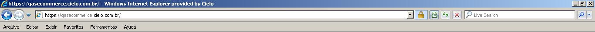
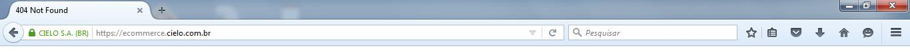
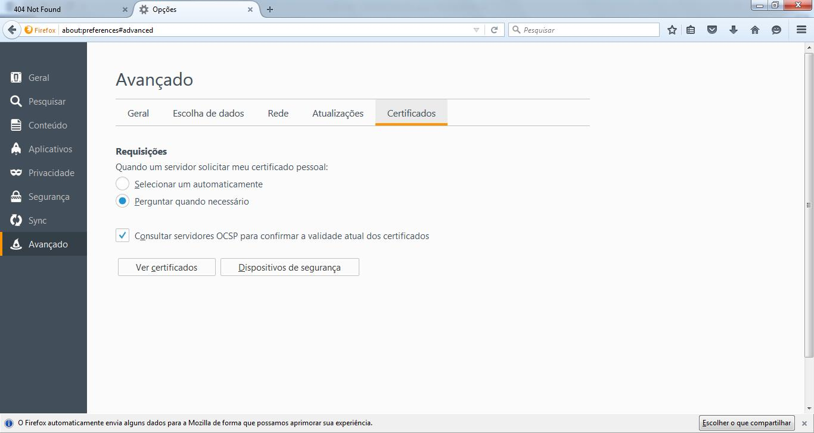
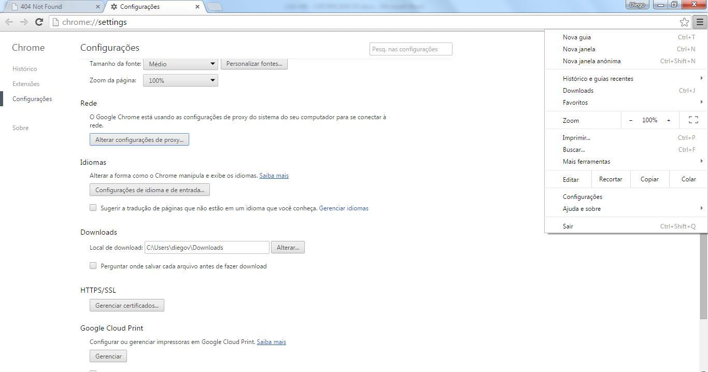
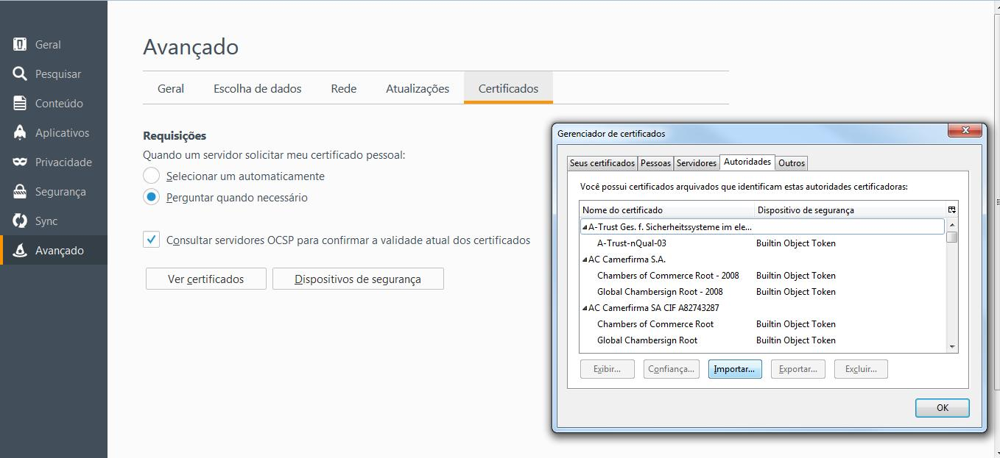
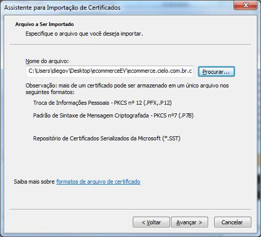

# Manual Checkout Cielo

The goal of this documentation is to orientate the developer about the integration method of Cielo Checkout API, a simplified solution where the customer is redirected to an online payment page secured by Cielo, providing a high level of security, attending the more strict safety regulations (PCI). In general, Cielo Checkout is a payment solution projected to increase conversion rates, make easier the purchase process, reduce frauds and operational costs. At this documentation, we described all functionalities of the integration, technical parameter and specially the examples of codes to facilitate your development.

Cielo Checkout uses a REST technology that should be used when a “shopping cart” must to be sent, in other words, the customer can browse on website, choose one or more products to add on shopping cart and then finish the purchase. There is also an option of integration by button that is always used if you have not a “shopping cart” at your store or when you want to associate a quick purchase directly to a product.

# Extended Validation Certificate

## What is SSL Certificate?

The Extended Validation Certificate for web server offers authenticity and integrity of data from a web site, provides customers of virtual stores the guarantee that they are actually accessing the site they want, and not a fraudster site.

Specialized companies are responsible for making domain validation and depending on the type of certificate, also the owner of the domain entity.

## What is EV SSL Certificate?

The EV Certificate was released in the market recently and ensures a higher level of security for customers of online stores.

It is a certificate of greater confidence and when https is accessed, the address bar turns green, giving more reliability to site visitors.

### Internet Explorer:



### Firefox



### Google Chrome


## How to install the Extended Validation Certificate in the shop server?

You just need to install the three following files on the Trustedstore server. Cielo does not support the installation of the certificate. If you are unsure on how to perform install the EV Certificate, then you should contact your server vendor support.

* [Root Certificate](./attachment/Raiz.crt)
* [Intermediate Certificate](./attachment/Intermediaria.crt)
* [E-Commerce Cielo Certificate](./attachment/ecommerce.cielo.com.br.crt)

<aside class="notice">If your server is a Linux distribution and you have familiarity and ssh access, then <a href="./attachment/cielo.sh">the Linux Installer - cielo.sh</a> can help you with the installation. Only use the installer if you know what you're doing. When in doubt, contact your server vendor support.</aside>

## Step by Step Installation

### INSTALLATION ON THE SERVER OF ONLINE STORE

To install the EV Certificate you shall contact your server vendor support.

<aside class="warning">Cielo does not support the installation of the certificate.</aside>

### CUSTOMER ACCESS TO ONLINE STORE

Normally, the browser makes a Certificate update automatically, in  case of failure and client contacted you to inform it, follow the steps:

#### 1st STEP:

Save the three files below into a new folder, or recall easily to be used later:

* [Root Certificate](./attachment/Raiz.crt)
* [Intermediate Certificate](./attachment/Intermediaria.crt)
* [E-Commerce Cielo Certificate](./attachment/ecommerce.cielo.com.br.crt)

#### 2nd STEP:

In the "Internet Explorer", click on "Tools" menu and access the "Internet Options":


In the "Firefox" browser, click on "Open Menu" and go to "Advanced" and "Options":



In "Chrome", click on  "Customize and control Google Chrome" and go to "Settings" and "Show advanced settings ..." “Change Proxy Settings” and "Content" and Certificates:



#### 3rd STEP:

In Internet Explorer, on "Certificates", click "Import".


In Firefox click "View Certificates", click "Import"



In Chrome click "Manage Certificates", click "Import"


#### 4th STEP:

In Internet Explorer and in Chrome, "Certificate import wizard", click "Next"


In Firefox "Abba servers," click "Import"


#### 5th STEP:

In Chrome and Internet Explorer "Certificate Import Assistent", click "Browse", find the folder where the files are and select the file "ecommerce.cielo.com.br.crt, click" Open "and then" Advance".




#### 6th STEP:

Select the desired option: add the certificate in a default folder or browse to the folder of your choice.


#### 7th STEP:

Click "Finish".


#### 8th STEP:

Click "Ok" to complete the import.


<aside class="notice">At Firefox does not appear the message “Import Successfully”, it just completes the import.</aside>

The certificate can be viewed in the default tab "Others" or chosen by the customer.

#### 9th STEP:

Repeat the same procedure for the 3 uploaded files.

### Questions:

If you have questions at any stage or other technical information, contact the Support Web Cielo e-Commerce in the following channels:

* **Email:** [cieloecommerce@cielo.com.br](mailto:cieloecommerce@cielo.com.br)
* **Metropolitan region:** 4002-9700
* **Other Cities:** 0800 570 1700

Hours: 24 hours a day, 7 days a week.

# Overview

In this guide will be presented an overview of Cielo Checkout and the technical mechanism of integration with shopping cart or button. For every purchase order, the target is convert it in a sale. A sale with card can be characterized by an authorized and captured transaction.

After the conclusion of the integration stage with Cielo, it’s essential that the retailer or online store manager has knowledge of functional process that will be part of the daily routine of store, like the follow-up of the financial transactions, status of each sale, actions (capture and cancellation) related to sales, charge statement, and so on. See the complement material about [BackOffice Checkout Cielo](http://developercielo.github.io/Checkout-Backoffice/).

## Considerations about the integration

* The store register must be activated at Cielo
* You must define an appropriate timeout on the HTTP requests to Cielo; we recommend 30 seconds.
* The Root certificate of certifying body (CA) of our Web Service must be registered at Truststore to be used. Because our certifying body has wider acceptance in the market, probably it’s already registered on Truststore at our own operational system. See the section [Certificated Extended Validation](#certificado-extended-validation) for more information.
* The monetary value is always handled as intire values, without representation of decimals place, in such case the last two digits are considered as “centavos”. Example: R$ 1.286,87 is represented as 128687; R$ 1,00 is represented as 100.

<aside class="notice">See the section [Certificated Extended Validation](#certificado-extended-validation) for more information</aside>

## Products and services

The current version of Cielo Checkout has support to following card issuers and products:

|Card issuer|Lump Sum|Credit installment store|Debit|Voucher|
|--------|---------------|----------------------|------|-------|
|Visa|Yes|Yes|Yes|No|
|Master Card|Yes|Yes|Yes|No|
|American Express|Yes|Yes|No|No|
|Elo|Yes|Yes|No|No|
|Diners Club|Yes|Yes|No|No|
|Discover|Yes|No|No|No|
|JCB|Yes|Yes|No|No|
|Aura|Yes|Yes|No|No|

## Historic of versions

* **Version 1.3** - 01/21/2015
    - Change of names – Solution integrated for Cielo Checkout
* **Version 1.2** - 01/09/2015
    - Inclusion of followers parameters at notification Post: `discount_amount`, `shipping_address_state`, `payment_boleto`, `number`, `tid`;
    - Alteration of parameter of order at Post of status change
* **Version 1.1** - 01/08/2015
    - Alignment of payment flux; inclusion of information of payment methods; inclusion at setting screen at Cielo [Checkout Backoffice](http://developercielo.github.io/Checkout-Backoffice/)
* **Version 1.0** - 11/24/2014
    - Initial version

## Cielo Support

After reading this documentation, if you still have questions (technical or not), you can check Cielo technical support 24 hours per day, 7 days of week, in Portuguese and English, in the following contacts:

* +55 4002-9700 - *Capitals and Metropolitan regions*
* +55 0800-570-1700 - *Others localities*
* +55 11 2860-1348 - *International*
    * Option 1: *Technical support*
    * Option 2: *E-commerce credential*
* Email: [cieloecommerce@cielo.com.br](mailto:cieloecommerce@cielo.com.br)

# Integration

## Shopping cart

This kind of integration must be used always when there is “shopping cart” to be sent, in other words, in case of customer browses through the website and choose one or more products to add at shopping cart implemented, see the integration section via Cielo Checkout button.

### Endpoint

Endpoint is the URL to where the requests with data of shopping cart are sent. All the requests must be sent using the method HTTP POST, to endpoint `https://cieloecommerce.cielo.com.br/api/public/v1/orders`.

### Authentication of store

```shell
-H "MerchantId: 00000000-0000-0000-0000-000000000000" \
```

```php
<?php
curl_setopt($curl, CURLOPT_HTTPHEADER, array('MerchantId: 00000000-0000-0000-0000-000000000000'));
```

```ruby
headers  = {:content_type => "application/json",:merchantid => "00000000-0000-0000-0000-000000000000"}
```

```python
headers = {"Content-Type": "application/json", "MerchantId": "00000000-0000-0000-0000-000000000000"}
```

```java
connection.addRequestProperty("MerchantId", "0000000-0000-0000-0000-000000000000");
```

```csharp
request.Headers["MerchantId"] = "00000000-0000-0000-0000-000000000000";
```

In this case, all the requests sent for Cielo must be authenticated for the store. The authentication consists at sending the Merchant Id, that is unique identifier of store provided for Cielo after the affiliation of store. The authentication of store must be done through the sending of field of header HTTP MerchandID, as illustrated below and next:

`MerchantId: 00000000-0000-0000-0000-000000000000`

### Request

```json
{
    "OrderNumber": "12344",
    "SoftDescriptor": "Nome que aparecerá na fatura",
    "Cart": {
        "Discount": {
            "Type": "Percent",
            "Value": 10
        },
        "Items": [
            {
                "Name": "Nome do produto",
                "Description": "Descrição do produto",
                "UnitPrice": 100,
                "Quantity": 2,
                "Type": "Asset",
                "Sku": "Sku do item no carrinho",
                "Weight": 200
            }
        ]
    },
    "Shipping": {
        "Type": "Correios",
        "SourceZipCode": "14400000",
        "TargetZipCode": "11000000",
        "Address": {
            "Street": "Endereço de entrega",
            "Number": "123",
            "Complement": "",
            "District": "Bairro da entrega",
            "City": "Cidade de entrega",
            "State": "São Paulo"
        },
        "Services": [
            {
                "Name": "Serviço de frete",
                "Price": 123,
                "Deadline": 15
            }
        ]
    },
    "Payment": {
        "BoletoDiscount": 0,
        "DebitDiscount": 10
    },
    "Customer": {
        "Identity": 11111111111,
        "FullName": "Fulano Comprador da Silva",
        "Email": "fulano@email.com",
        "Phone": "11999999999"
    },
    "Options": {
        "AntifraudEnabled": false
    }
}
```

```shell
curl -X POST "https://cieloecommerce.cielo.com.br/api/public/v1/orders" \
     -H "MerchantId: 00000000-0000-0000-0000-000000000000" \
     -H "Content-Type: application/json" \
     -d '{
             "OrderNumber": "12344",
             "SoftDescriptor": "Nome que aparecerá na fatura",
             "Cart": {
                  "Discount": {
                      "Type": "Percent",
                      "Value": 10
                  },
                  "Items": [
                      {
                          "Name": "Nome do produto",
                          "Description": "Descrição do produto",
                          "UnitPrice": 100,
                          "Quantity": 2,
                          "Type": "Asset",
                          "Sku": "Sku do item no carrinho",
                          "Weight": 200
                      }
                  ]
             },
             "Shipping": {
                  "Type": "Correios",
                  "SourceZipCode": "14400000",
                  "TargetZipCode": "11000000",
                  "Address": {
                      "Street": "Endereço de entrega",
                      "Number": "123",
                      "Complement": "",
                      "District": "Bairro da entrega",
                      "City": "Cidade de entrega",
                      "State": "São Paulo"
                  },
                  "Services": [
                      {
                          "Name": "Serviço de frete",
                          "Price": 123,
                          "Deadline": 15
                      }
                  ]
             },
             "Payment": {
                  "BoletoDiscount": 0,
                  "DebitDiscount": 10
             },
             "Customer": {
                  "Identity": 11111111111,
                  "FullName": "Fulano Comprador da Silva",
                  "Email": "fulano@email.com",
                  "Phone": "11999999999"
             },
             "Options": {
                  "AntifraudEnabled": false
             }
         }'
```

```php
<?php
$order = new stdClass();
$order->OrderNumber = '1234';
$order->SoftDescriptor = 'Nome que aparecerá na fatura';
$order->Cart = new stdClass();
$order->Cart->Discount = new stdClass();
$order->Cart->Discount->Type = 'Percent';
$order->Cart->Discount->Value = 10;
$order->Cart->Items = array();
$order->Cart->Items[0] = new stdClass();
$order->Cart->Items[0]->Name = 'Nome do produto';
$order->Cart->Items[0]->Description = 'Descrição do produto';
$order->Cart->Items[0]->UnitPrice = 100;
$order->Cart->Items[0]->Quantity = 2;
$order->Cart->Items[0]->Type = 'Asset';
$order->Cart->Items[0]->Sku = 'Sku do item no carrinho';
$order->Cart->Items[0]->Weight = 200;
$order->Shipping = new stdClass();
$order->Shipping->Type = 'Correios';
$order->Shipping->SourceZipCode = '14400000';
$order->Shipping->TargetZipCode = '11000000';
$order->Shipping->Address = new stdClass();
$order->Shipping->Address->Street = 'Endereço de entrega';
$order->Shipping->Address->Number = '123';
$order->Shipping->Address->Complement = '';
$order->Shipping->Address->District = 'Bairro da entrega';
$order->Shipping->Address->City = 'Cidade da entrega';
$order->Shipping->Address->State = 'São Paulo';
$order->Shipping->Services = array();
$order->Shipping->Services[0] = new stdClass();
$order->Shipping->Services[0]->Name = 'Serviço de frete';
$order->Shipping->Services[0]->Price = 123;
$order->Shipping->Services[0]->DeadLine = 15;
$order->Payment = new stdClass();
$order->Payment->BoletoDiscount = 0;
$order->Payment->DebitDiscount = 10;
$order->Customer = new stdClass();
$order->Customer->Identity = 11111111111;
$order->Customer->FullName = 'Fulano Comprador da Silva';
$order->Customer->Email = 'fulano@email.com';
$order->Customer->Phone = '11999999999';
$order->Options = new stdClass();
$order->Options->AntifraudEnabled = false;

$curl = curl_init();

curl_setopt($curl, CURLOPT_URL, 'https://cieloecommerce.cielo.com.br/api/public/v1/orders');
curl_setopt($curl, CURLOPT_SSL_VERIFYPEER, false);
curl_setopt($curl, CURLOPT_RETURNTRANSFER, true);
curl_setopt($curl, CURLOPT_POST, true);
curl_setopt($curl, CURLOPT_POSTFIELDS, json_encode($order));
curl_setopt($curl, CURLOPT_HTTPHEADER, array(
    'MerchantId: 00000000-0000-0000-0000-000000000000',
    'Content-Type: application/json'
));

$response = curl_exec($curl);

curl_close($curl);

$json = json_decode($response);
```

```python
from urllib2 import Request, urlopen
from json import dumps

json = dumps({
    "OrderNumber": "12344",
    "SoftDescriptor": "Nome que aparecerá na fatura",
    "Cart": {
        "Discount": {
            "Type": "Percent",
            "Value": 10
        },
        "Items": [
            {
                "Name": "Nome do produto",
                "Description": "Descrição do produto",
                "UnitPrice": 100,
                "Quantity": 2,
                "Type": "Asset",
                "Sku": "Sku do item no carrinho",
                "Weight": 200
            }
        ]
    },
    "Shipping": {
        "Type": "Correios",
        "SourceZipCode": "14400000",
        "TargetZipCode": "11000000",
        "Address": {
            "Street": "Endereço de entrega",
            "Number": "123",
            "Complement": "",
            "District": "Bairro da entrega",
            "City": "Cidade de entrega",
            "State": "São Paulo"
        },
        "Services": [
            {
                "Name": "Serviço de frete",
                "Price": 123,
                "Deadline": 15
            }
        ]
    },
    "Payment": {
        "BoletoDiscount": 0,
        "DebitDiscount": 10
    },
    "Customer": {
        "Identity": 11111111111,
        "FullName": "Fulano Comprador da Silva",
        "Email": "fulano@email.com",
        "Phone": "11999999999"
    },
    "Options": {
        "AntifraudEnabled": false
    }
})

headers = {"Content-Type": "application/json", "MerchantId": "00000000-0000-0000-0000-000000000000"}
request = Request("https://cieloecommerce.cielo.com.br/api/public/v1/orders", data=json, headers=headers)
response = urlopen(request).read()

print response
```

```ruby
require 'rubygems' if RUBY_VERSION < '1.9'
require 'rest-client'
require 'json'

request = JSON.generate({
    "OrderNumber" => "12344",
    "SoftDescriptor" => "Nome que aparecerá na fatura",
    "Cart" => {
        "Discount" => {
            "Type" => "Percent",
            "Value" => 10
        },
        "Items" => [
            {
                "Name" => "Nome do produto",
                "Description" => "Descrição do produto",
                "UnitPrice" => 100,
                "Quantity" => 2,
                "Type" => "Asset",
                "Sku" => "Sku do item no carrinho",
                "Weight" => 200
            }
        ]
    },
    "Shipping" => {
        "Type" => "Correios",
        "SourceZipCode" => "14400000",
        "TargetZipCode" => "11000000",
        "Address" => {
            "Street" => "Endereço de entrega",
            "Number" => "123",
            "Complement" => "",
            "District" => "Bairro da entrega",
            "City" => "Cidade de entrega",
            "State" => "São Paulo"
        },
        "Services" => [
            {
                "Name" => "Serviço de frete",
                "Price" => 123,
                "Deadline" => 15
            }
        ]
    },
    "Payment" => {
        "BoletoDiscount" => 0,
        "DebitDiscount" => 10
    },
    "Customer" => {
        "Identity" => 11111111111,
        "FullName" => "Fulano Comprador da Silva",
        "Email" => "fulano@email.com",
        "Phone" => "11999999999"
    },
    "Options" => {
        "AntifraudEnabled" => false
    }
})

headers  = {:content_type => "application/json",:merchantid => "00000000-0000-0000-0000-000000000000"}
response = RestClient.post "https://cieloecommerce.cielo.com.br/api/public/v1/orders", request, headers

puts response
```

```java
String json = "{"
            + "    \"OrderNumber\": \"12344\","
            + "    \"SoftDescriptor\": \"Nome que aparecerá na fatura\","
            + "    \"Cart\": {"
            + "        \"Discount\": {"
            + "            \"Type\": \"Percent\","
            + "            \"Value\": 10"
            + "        },"
            + "        \"Items\": ["
            + "            {"
            + "                \"Name\": \"Nome do produto\","
            + "                \"Description\": \"Descrição do produto\","
            + "                \"UnitPrice\": 100,"
            + "                \"Quantity\": 2,"
            + "                \"Type\": \"Asset\","
            + "                \"Sku\": \"Sku do item no carrinho\","
            + "                \"Weight\": 200"
            + "            }"
            + "        ]"
            + "    },"
            + "    \"Shipping\": {"
            + "        \"Type\": \"Correios\","
            + "        \"SourceZipCode\": \"14400000\","
            + "        \"TargetZipCode\": \"11000000\","
            + "        \"Address\": {"
            + "            \"Street\": \"Endereço de entrega\","
            + "            \"Number\": \"123\","
            + "            \"Complement\": \"\","
            + "            \"District\": \"Bairro da entrega\","
            + "            \"City\": \"Cidade de entrega\","
            + "            \"State\": \"São Paulo\""
            + "        },"
            + "        \"Services\": ["
            + "            {"
            + "                \"Name\": \"Serviço de frete\","
            + "                \"Price\": 123,"
            + "                \"Deadline\": 15"
            + "            }"
            + "        ]"
            + "    },"
            + "    \"Payment\": {"
            + "        \"BoletoDiscount\": 0,"
            + "        \"DebitDiscount\": 10"
            + "     },"
            + "     \"Customer\": {"
            + "         \"Identity\": 11111111111,"
            + "         \"FullName\": \"Fulano Comprador da Silva\","
            + "         \"Email\": \"fulano@email.com\","
            + "         \"Phone\": \"11999999999\""
            + "     },"
            + "     \"Options\": {"
            + "         \"AntifraudEnabled\": false"
            + "     }"
            + "}";

URL url;
HttpURLConnection connection;
BufferedReader bufferedReader;

try {
    url = new URL("https://cieloecommerce.cielo.com.br/api/public/v1/orders");

    connection = (HttpURLConnection) url.openConnection();
    connection.setRequestMethod("POST");
    connection.addRequestProperty("MerchantId", "0000000-0000-0000-0000-000000000000");
    connection.setRequestProperty("Content-Type", "application/json; charset=utf-8");
    connection.setDoOutput(true);

    DataOutputStream jsonRequest = new DataOutputStream(
                connection.getOutputStream());

    jsonRequest.writeBytes(json);
    jsonRequest.flush();
    jsonRequest.close();

    bufferedReader = new BufferedReader(new InputStreamReader(
                connection.getInputStream()));

    String responseLine;
    StringBuffer jsonResponse = new StringBuffer();

    while ((responseLine = bufferedReader.readLine()) != null) {
        jsonResponse.append(responseLine);
    }

    bufferedReader.close();

    connection.disconnect();
} catch (Exception e) {
    e.printStackTrace();
}
```

```csharp
HttpWebRequest request = (HttpWebRequest)
                         WebRequest.Create("https://cieloecommerce.cielo.com.br/api/public/v1/orders");

request.Method = "POST";
request.Headers["Content-Type"] = "text/json";
request.Headers["MerchantKey"] = "06eadc0b-2e32-449b-be61-6fd4f1811708";

string json = "{"
            + "    \"OrderNumber\": \"12344\","
            + "    \"SoftDescriptor\": \"Nome que aparecerá na fatura\","
            + "    \"Cart\": {"
            + "        \"Discount\": {"
            + "            \"Type\": \"Percent\","
            + "            \"Value\": 10"
            + "        },"
            + "        \"Items\": ["
            + "            {"
            + "                \"Name\": \"Nome do produto\","
            + "                \"Description\": \"Descrição do produto\","
            + "                \"UnitPrice\": 100,"
            + "                \"Quantity\": 2,"
            + "                \"Type\": \"Asset\","
            + "                \"Sku\": \"Sku do item no carrinho\","
            + "                \"Weight\": 200"
            + "            }"
            + "        ]"
            + "    },"
            + "    \"Shipping\": {"
            + "        \"Type\": \"Correios\","
            + "        \"SourceZipCode\": \"14400000\","
            + "        \"TargetZipCode\": \"11000000\","
            + "        \"Address\": {"
            + "            \"Street\": \"Endereço de entrega\","
            + "            \"Number\": \"123\","
            + "            \"Complement\": \"\","
            + "            \"District\": \"Bairro da entrega\","
            + "            \"City\": \"Cidade de entrega\","
            + "            \"State\": \"São Paulo\""
            + "        },"
            + "        \"Services\": ["
            + "            {"
            + "                \"Name\": \"Serviço de frete\","
            + "                \"Price\": 123,"
            + "                \"Deadline\": 15"
            + "            }"
            + "        ]"
            + "    },"
            + "    \"Payment\": {"
            + "        \"BoletoDiscount\": 0,"
            + "        \"DebitDiscount\": 10"
            + "     },"
            + "     \"Customer\": {"
            + "         \"Identity\": 11111111111,"
            + "         \"FullName\": \"Fulano Comprador da Silva\","
            + "         \"Email\": \"fulano@email.com\","
            + "         \"Phone\": \"11999999999\""
            + "     },"
            + "     \"Options\": {"
            + "         \"AntifraudEnabled\": false"
            + "     }"
            + "}";

using (var writer = new StreamWriter(request.GetRequestStream()))
{
    writer.Write(json);
	writer.Close();
}

HttpWebRequest response = (HttpWebResponse) request.GetResponse();
```

#### Cabeçalho HTTP

|Field|Type|Mandatory|Size|Description|
|-----|----|-----------|-------|---------|
|MerchantId|Guid|Yes|36|Unique identifier of store. Format: 00000000-0000-0000-0000-000000000000|
|Content-type|Alphanumeric|Yes|n/a|Type of message content sent. Use: “application/json”|

#### Object request root

|Field|Type|Mandatory|Size|Description|
|-----|----|-----------|-------|---------|
|OrderNumber|Alphanumeric|Optional|0..64|Order number of store.|
|SoftDescriptor|Alphanumeric|Optional|0..13|Text to be displayed at holder invoice, after the commercial establishment name.|
|Cart|Cart|Sim|n/a|Information about the cart shopping.|
|Shipping|Shipping|Sim|n/a|Information about the order delivery.|
|Payment|Payment|Conditional|n/a|Information about the order payment.|
|Customer|Customer|Condicional|n/a|Information about the personal data of buyer.|
|Options|Options|Conditional|n/a|Information about the configurable options of order.|

### Response

### In case of success

```json
{
    "Settings": {
        "CheckoutUrl": "https://cieloecommerce.cielo.com.br/transacional/order/index?id=123",
        "Profile": "CheckoutCielo",
        "Version": 1
    }
}
```

|Field|Type|Mandatory|Size|Description|
|-----|----|-----------|-------|---------|
|Settings|Settings|Yes|n/a|Information about the order creation.|

### In case of error

```json
{
    "message":"An error has occurred."
}
```

|Field|Type|Mandatory|Size|Description|
|-----|----|-----------|-------|---------|
|Message|String|Yes|1..254|Message descriptive of error|


### Error of integration

There are two types of error that can happen during the integration process with Cielo Checkout. Here they are:

* **Before the exhibition in Checkout screen**: This means that there is a mistake in data that has been sent in the transaction. Mandatory data probably has been forgotten or they probably are in an invalid format;
* **After the exhibition in Checkout screen (when the sale is finished)**: This means that there is an impediment of registration that limit the sale. Things like blocked affiliation, error in data saved at registration or problems in own checkout.

## Button

Integration via Button is a method of purchase used always that there isn’t a “shopping cart” in your store or when you want to associate a quick direct purchase to a product, as a promotion in a homepage jumping the cart stage.

The integration via button also can be used to send an e-mail marketing or a charge via e-mail, in other words, adding a button (HTTP) referent to a product/service to be bought/paid. Or always that you want to make available a quick sale.

To use this feature, it’s necessary register the product that you want to sell, your information, and then just copy the source code created for this button. The inclusion of products is done inside the [Backoffice Cielo Checkout](http://developercielo.github.io/Checkout-Backoffice/), at menu of Products/Register Product.


* Button characteristics.
* Each button created leads to a certain product, only.
* The price of product can not be changed on Checkout screen.
* It’s not necessary to develop a cart..
* The registration of product is mandatory for creating the button.

Each button has a unique code that just allows to buy that certain product in the condition of price and shipping registered. Therefore, the fraudster can’t change any of these information when submitting it to the purchase, because the Cielo Checkout will search all data of product in the registration of [Backoffice Cielo Checkout](http://developercielo.github.io/Checkout-Backoffice/), and has validity the data of registration.

### Parameters for product registration

Below you see the information necessary to register the product.

|Parameter|Description|Size Min.|Size Máx.|Mandatory|
|---------|---------|------------|------------|-----------|
|Type of Product|Signal if you are selling material goods, service, or digital goods, it won’t be presented the option of shipping type.|n/a|n/a|Yes|
|SKU|Product identification code|1|50|No|
|Title|Product title|1|50|yes|
|Description|Product description|1|255|Yes|
|Price|Total amount of order in “centavos” (ex.: R$1,00 =100).|11|14|Yes|
|Shipping/Delivery|Choose among the Shipping options (Correios, Flat Postage Cost , Free Shipping, pick up on store, no charge).|n/a|n/a|Yes|
|Origin CEP|This field only appears for a Correios shipping, and must be filled with CEP, from will leave the product for purposes of shipping calculation.|9|9|Yes|
|Weight(kg)|This field only appears for Correios shipping, and must be filled with the weight of the product in kg (kilograms) for purposes of shipping calculation.|n/a|n/a|Yes|
|Shipping amount|This field only appears for fixed shipping with the amount that the retailer specifies for the products.|n/a|n/a|Yes|
|Sending method|This field only appears for Product Type similar to Physical Material and Shipping Type similar to Fixed Shipping.|n/a|n/a|Yes|
|URL|This field only appears for Product type similar to Digital.|n/a|n/a|Yes|

#### Button example:

```html
<form method='post' action='https://cieloecommerce.cielo.com.br/transactional/Checkout/BuyNow' target='blank'>
    <input type='hidden' name='id' value=00000000-0000-0000-000000000000/><input type='image' name='submit' alt='Comprar' src='https://cieloecommerce.cielo.com.br /BackOffice/Content/images/botao_comprar_3.jpg' />
</form>
```

Adding the button on your HTML page you have to copy the button HTML code created and put the HTML code on your website, as the example below:

Each button has a unique code that only allows to buy a certain product in the pricing and shipping conditions registered. Therefore, the fraudster can’t change any of these information on purchase submit, because Cielo Checkout will search all product data on [Backoffice Cielo Checkout](http://developercielo.github.io/Checkout-Backoffice/), and will be considered the registration data.

## Cielo Checkout testing mode

The Cielo Checkout testing mode is a method to do integration tests on your website, without the credit usage. The Cielo Checkout testing mode allows to execute transactions using different payment methods mock (simulative).

### Testing mode activation/validation

The testing mode can be activated on Settings tab:


In this area there is a selection box, that once been marked, will enable the Cielo Checkout testing mode. The mode only will starts when the selection has been saved.


When the option is saved, a red stripe will be exhibited on top area of screen. It will be displayed at all screens of Cielo Checkout Backoffice and the checkout screen of Cielo Checkout.

This stripe indicates that your Cielo Checkout store is operating now in a testing environment, in other words, all transaction executed in this mode will be considered as a test.


### How transact on Testing Mode

The transactions execution on testing mode happens in normal form. The information of transaction will be sent via POST, using the parameters as described on topic Integration with shopping cart, however, the payment methods to be used will be simulated methods.

To execute test transactions with different payment methods, follow the next rules:

**a - Credit Card Transactions:**

To test credit cards it’s necessary to define two important data; the authorization status of card and the fraud analysis return.

**Status of Credit Card Authorization **

|Card Final Digit|Returned Status|
|----------------------|----------------|
|0, 1, 2, 3 ou 4|Authorized|
|5, 6, 7, 8 ou 9|Unauthorized|

* **Example**: Authorized transaction, High risk;
* **Credit card Number**: 5404434242930107
* **Customer name**: Maria Alto

**b - Boleto Bancario**

You simply carry out the purchase process without any changes on your proceeding. The boleto created on testing mode will always be a simulated boleto.

**c - Online Debit**

It’s necessary to inform the transaction status of online debit transaction. This process happens like in the anti fraud of credit card described above, with change for buyer name.

**Debit Status**

|Customer Lastname|Status|
|---------------------|------|
|Paid|Paid|
|Any name|Unauthorized|

* **Example**: Unauthorized Status.
* **Customer name**: Maria Pereira

**d - Testing transaction**

All the transaction executed on testing mode will be displayed as normal transactions on Order Tab of Cielo Checkout, but, they will be marked as testing transactions and won’t be counted combined with all transactions executed outside of testing environment.


These transaction will have a symbol of test to distinguish of other transactions. They can be captured or canceled using the same proceedings of real transactions.


# Integration Parameters

## Cart

```json
{
    "Discount": {},
    "Items": []
}
```

Request parameter with information about shopping cart. See also the parameter Item [Item](#item)

|Field|Type|Mandatory|Size|Description|
|-----|----|-----------|-------|---------|
|Discount|[Discount](#discount)|Optional|n/a|Discount information about the shopping cart.|
|Items|[Item[]](#item)|Sim|n/a|List of shopping cart items (must contain at minimum of 1 item).|

### Discount

```json
{
    "Type": "Percent",
    "Value": 10
}
```

Request Parameter with information about discounts.

|Field|Type|Mandatory|Size|Description|
|-----|----|-----------|-------|---------|
|Type|Alphanumeric|Conditional|n/a|Type of discount to be applied:  "Amount”, “Percent”. It’s mandatory in case of the Value being higher or equals zero. |
|Value|Numeric|Conditional|0..18|Discount value to be applied (it can be an absolute value or percentage). It’s mandatory in case of Type being “Amount” or “Percent”.|

#### Discount.Type = Amount

In case of a type of discount chosen being the Amount, it must be insert the value in centavos. Ex.: 100 = 1,00.

#### Discount.Type Percent

In case the discount type chosen being Percentual, it must be insert the integer number value. Ex.: 10 = 10%.

### Item

```json
{
    "Name": "Nome do produto",
    "Description": "Descrição do produto",
    "UnitPrice": 100,
    "Quantity": 2,
    "Type": "Asset",
    "Sku": "Sku do item no carrinho",
    "Weight": 200
}
```

Parameter of request with information about a shopping cart item. See also the [Cart](#cart) parameter.

|Field|Type|Mandatory|Size|Description|
|-----|----|-----------|-------|---------|
|Name|Alphanumeric|Sim|1..128|Item’s name of cart.|
|Description|Alphanumeric|Opcional|0.256|Item description in the cart |
|UnitPrice|Numeric|Sim|1..18|Unit price of item in cart (in centavos.* Ex: R$ 1,00 = 100)*.|
|Quantity|Numeric|Sim|1..9|Quantity of item in cart|
|Type|Alphanumeric|Sim|n/a|Item type in cart|
|Sku|Alphanumeric|Opcional|0..32|Item Sku in cart.|
|Weight|Numeric|Condicional|0..9|Weight in grams of item in cart|

#### Items type

|Tipo|Descrição|
|----|---------|
|Asset|Physical material|
|Digital|Digital Goods|
|Service|Services|
|Payment|Other payments|

## Shipping

```json
{
    "Type": "Correios",
    "SourceZipCode": "14400000",
    "TargetZipCode": "11000000",
    "Address": {},
    "Services": []
}
```

Request parameter with information about the address and shipping service of product delivery.

|Field|Type|Mandatory|Size|Description|
|-----|----|-----------|-------|---------|
|Type|Alphanumeric|Sim|n/a|Shipping type: “Correios”, “FixedAmount”, “Free”, “WithoutShippingPickUp”, “WithoutShipping”.|
|SourceZipCode|Numeric|Condicional|8|Origin Zip code of shopping cart|
|TargetZipCode|Numeric|Opcional|8|Zip code of customer shipping address |
|Address|[Address](#address)|Opcional|n/a|Information about the customer shipping address|
|Services|[Service[]](#service)|Condicional|n/a|List of shipping services |

### Address

```json
{
    "Street": "Endereço de entrega",
    "Number": "123",
    "Complement": "",
    "District": "Bairro da entrega",
    "City": "Cidade de entrega",
    "State": "São Paulo"
}
```

Request parameter with information about the customer address. See also the Customer [Customer](#customer) parameter

|Field|Type|Mandatory|Size|Description|
|-----|----|-----------|-------|---------|
|Street|Alphanumeric|Sim|1..256|Street, avenue, crosspiece, etc, of customer shipping address.|
|Number|Alphanumeric|Sim|1..8|Number of customer shipping address|
|Complement|Alphanumeric|Opcional|0..256|Complement of customer shipping address  |
|District|Alphanumeric|Sim|1..64|Neighborhood (district) of customer shipping address. |
|City|Alphanumeric|Sim|1..64|City of customer shipping address.|
|State|Alphanumeric|Sim|2|Federal State (UF) of customer shipping address. |

### Service

```json
{
    "Name": "Serviço de frete",
    "Price": 123,
    "Deadline": 15
}
```

Request parameter with information about the shipping service that will be used.

|Field|Type|Mandatory|Size|Description|
|-----|----|-----------|-------|---------|
|Name|Alphanumeric|Sim|1..128|Shipping service name|
|Price|Numeric|Sim|1..18|Shipping service price (in centavos. Ex: R$ 1,00 = 100).|
|Deadline|Numeric|Condicional|0..9|Delivery deadline (in days).|

## Payment

```json
{
    "BoletoDiscount": 0,
    "DebitDiscount": 10
}
```

Request parameter with information about the discount for payment via boleto or online debit.

|Field|Type|Mandatory|Size|Description|
|-----|----|-----------|-------|---------|
|BoletoDiscount|Numeric|Condicional|0..3|Discount, in percentage, for payment to be executed with boleto.|
|DebitDiscount|Numeric|Condicional|0..3|Discount, in percentage, for payment to be executed online debit.|

## Customer

```json
{
    "Identity": 11111111111,
    "FullName": "Fulano Comprador da Silva",
    "Email": "fulano@email.com",
    "Phone": "11999999999"
}
```

Request parameter with information about the buyer. See also [Address](#address) Parameter.

|Field|Type|Mandatory|Size|Description|
|-----|----|-----------|-------|---------|
|Identity|Numeric|Condicional|0..14|Customer CPF or CNPJ (digital certificate
for the Brazilian legal entities)|
|FullName|Alphanumeric|Condicional|0..288|Complete customer name. |
|Email|Alphanumeric|Condicional|0..64|Customer Email.|
|Phone|Numeric|Condicional|0..11|Customer telephone |

## Options

```json
{
    "AntifraudEnabled": false
}
```

Request parameter to configure the anti fraud system for a transaction.

|Field|Type|Mandatory|Size|Description|
|-----|----|-----------|-------|---------|
|AntifraudEnabled|Boolean|Conditional|n/a|Enable or not a fraud analysis for an order |

## Settings

Response parameter, received in case of success.

```json
{
    "CheckoutUrl": "https://cieloecommerce.cielo.com.br/transacional/order/index?id=123",
    "Profile": "CheckoutCielo",
    "Version": 1
}
```

|Field|Type|Mandatory|Size|Description|
|-----|----|-----------|-------|---------|
|CheckoutUrl|Alphanumeric|Sim|1..128|Checkout URL of order. **Format**: `https://cieloecommerce.cielo.com.br/transacional/order/index?id={id}`|
|Profile|Alphanumeric|Sim|1..16|Retailer’s profile: fix “CheckoutCielo”.|
|Version|Alphanumeric|Sim|1|Service version of order creation (version: 1).|

# Payment configuration

## Credit card

Cielo Checkout accepts the main card issuers of Brazil and world. They are: Visa, MasterCard, American Express (Amex), Elo, Diners, Discover, JCB and Aura.

### Receiving a sale with Credit Card

From the creation of a transaction, it can assume different status. The transaction status can be performed through the exchange of messages between the store and Cielo, or, in automatic form, for example, when the deadline to a capture of an authorized transaction expires.

Orders for credit card will be included on Cielo Checkout Backoffice as “AUTHORIZED” or “UNAUTHORIZED”, depending of the result of authorization at Cielo. If you have any problems during the proceeding of this order (the customer closed the screen, for example), it will be recorded as “DO NOT FINISHED”.

### Fraud analysis

Order “AUTHORIZED” will be sent online, in other words, in act of sale, for analysis of anti fraud solution, when this development being properly standardized in the integration. The result of this analysis will be translated in the field “Indication AF”, at Order Report, for each order.

This analysis will indicate a “LOW RISK” or “HIGH RISK” for the sale in question. This suggestion is what that must guide the decision of approve or cancel a sale. The analysis will be presented at “Order Details”, as below:


## Debit card

Cielo Checkout Cielo accepts the main card issuers of debit in the market:  Visa and MasterCard. The transaction of debit card have as participants the issuer banks, that which in turn use the same resources of online transaction (token, password card, etc) for the authentication process.

Consult the relation between participants issuers on Cielo e-commerce Support

* **E-mail**: [cieloecommerce@cielo.com.br](mailto:cieloecommerce@cielo.com.br)
* **Telephones**:
    * **Capital**: (sem DDD) 4002.9700
    * **Other Location**: 0800.570.1700
    * **From abroad**: +55 (11) 2860.1348

The transaction authentication will guarantee an extra security to the retail against Contesting process of Customer (Chargeback). The debit product mandatorily needs an authenticated transaction, otherwise, the transaction can not be authorized. The authentication is mandatory to debit transactions and optional for credit.

### Step by step of a debit card transaction

1. Customer access the internet banking
2. Type the card password
3. Bank confirms the password
4. Realised Transaction

## Boleto

All boleto created (issued) appears with status of “PENDENT” on Order Report. The status change will depend of guide actions of the personal retailer. For that, access the Cielo Checkout Backoffice (include link of the guide) in the section Orders

### Possible Status of Boleto

* **PENDENT** – boleto issued by the transactions process. Status continues until the manual change by retailer.
* **PAID** – Status used when the button “Conciliate” is activated by the retailer. This status can be reverted for pendent using the Button “Undo conciliation”.
* **EXPIRED** – Status activated after 10 days of creation of the boleto, if it’s not conciliated in this period. Boletos with “EXPIRED” status can be conciliated.

### Conciliating a Boleto

It’s incumbent upon the retailer the Manual Conciliation with his bank statement, and confirm the payment of it.


To realise the Conciliation you will need:

1. Access the order report on Cielo Checkout Backoffice;
2. Filter the order by Payment Method “Boleto” and status “PENDENT” and identify the boleto in question by value/amount;
3. Click in the symbol + in the end of the line to access the page of “Details”;
4. Click in the button of “Confirm Payment” and inform the date of payment, for your forward control;

The order pass for PAID status.

The Customer also will see the order as PAID on “Customer Backoffice”

To undo the conciliation (payment) of a Boleto, if the conciliation has been done in a wrong form, you just need:

1. Find the Order;
2. Enter in the detail and click on the button “Undo Payment”;
3. The order will come back to “PENDENT” .

### Expired Boletos

If the boleto don’t be conciliated within 10 days after the expiration, its status will be changed to “EXPIRED”, for a better control of overdue boletos. EXPIRED boletos can be conciliated.


## Online Debit

Order done by online debit will be included on Cielo Checkout Backoffice as PENDENT, PAID, UNAUTHORIZED or DO NOT FINISHED, depending of the result of authorization at the Bank.

* **Pendent** - Correspond to a moment when the customer finishes the order and doesn’t obtain the response of the Bank, in other words, the customer can’t get load the Bank Page to insert the information to debit.
* **Paid** - It’s when the customer completed the payment with debit successfully.
* **Unauthorized** - Presented to the retailer when the customer tries to realise a transaction via debit and don’t have any final balance to the transaction
* **Not finished** - Presented to the retailer when the customer has a problem to finish the payment with debit, closing the bank page or just if he don’t reach the bank page

## Difference between reverse charge and cancellation

* **Cancellation**: it’s done in the same day of the capture, paying back the customer card limit in until 72h, according the card issuer bank rules. It’s not presented the customer invoice.
* **Reverse charge**: from the next day of the capture, the value is “returned” on customer invoice within 300 days. It’s presented on customer invoice.

## Capture/Automatic Cancellation

<aside class="notice"><a href="#diferença-entre-estorno-e-cancelamento">Difference between reverse charge and cancellation</a></aside>

### Automatic capture

The “AUTHORIZED”, and “LOW RISK” sales at anti fraud tools can be CAPTURED automatically by the system. For that, it’s necessary configure at Cielo Checkout Backoffice. After this configuration, the status presented will be “PAID”. This sale will be then, confirmed (captured) at Cielo.


### Automatic Cancellation

The “AUTHORIZED”, and “HIGH RISK” sales with anti fraud solutions can be CANCELED automatically on Cielo Checkout Backoffice by the system. For that, it’s necessary to configure at Cielo Checkout Backoffice. After this configuration, the status presented will be “CANCELED”. Then this sale will be canceled (undo) at Cielo.


## Capture/Manual Cancellation

The “AUTHORIZED” sales waits a decision of confirmation or cancellation. This decision has to come according to the fraud analysis, in case of this feature is properly parameterized on integration.

The sales confirmation must be done by the button CAPTURE, on the “ORDER” tab, on Cielo Checkout Backoffice. After this confirmation, the status will change for “PAID”. This sale will be confirmed (captured) on Cielo.

The cancellation must be done by the button CANCEL in the same section on Cielo Checkout Backoffice. After the cancellation, the status will change for “CANCEL”. This sale will be canceled (undone) then on Cielo.

## Sales reverse charge

In case of the sale has been already confirmed (status PAID) it’s can be yet, subsequently, reversed. For that, you just need click on the button for Order Details

### Sales with expired credit card

When the deadline of sales confirmation expires, the orders will go automatically to “EXPIRED” status. This will happens in the sixth day after the authorization date (sales date).

## Chargeback

The customer (buyer) can, for any reason, cancel the purchase directly with the issuer bank of credit card. In case of this happens, the retailer will receive from Cielo a warning of Chargeback of “No recognition of purchase” or in case of a purchase with a phished card, you will receive a warning of Chargeback for “Fraud”.


This communication it’s not done via Cielo Checkout Backoffice, but by the Cielo Sales Statement, highlighted as a financial adjust. The statement of sales will be available at Cielo website www.cielo.com.br on tab “Access My Account”: [www.cielo.com.br na aba “Acessar Minha conta”](https://www.cielo.com.br/minha-conta).


After this receipt, the own Cielo website is possible to access the Cielo Checkout Backoffice and signalize the order as receipt a Chargeback, to your better control. You just need enter on “Order Details” and click on the button “Chargeback” and your status will become “CHARGEBACK”.

## Shipping

The Cielo checkout supports differents types of shipping, that can be used on differents ways according to the option offered in your store. The options available are:

* Correios
* Frete Fixo
* Frete Grátis
* Sem Frete

The manner and type of shipping that will keep activated in your store is configured on the Cielo Checkout Backoffice. Because of the technical aspect, we suggest that the developers do the shipping settings. Different of shipping calculation:

### Shipping calculation by your own

It’s possible to select one or more options of shipping. They are presented to the customer according to the choice between the available options. The selected value by customer will be added to the total amount of purchase.

### Agreement with Correios

* The Cielo Checkout will use this number of contract to do the shipping calculation, using the shipping table that you have agreed with Correios.
* This way, the checkout will present all shipping options of Correios (Sedex, Sedex 10, Sedex. Today and PAC, etc) to the customer chooses, according to the destiny zip code typed. The value selected by customer will be added to the total purchase amount.
* Selection of shipping on shopping cart and not in Cielo Checkout. The Cielo Checkout only will present the screen of choice of payment method for the customer. The shipping amount is already embed on final amount.
