# Sobre o Checkout Cielo.

O **Checkout Cielo** é uma solução que agrega vários serviços de processamento de pagamento, no qual o consumidor é direcionado para uma página de pagamento online segura da Cielo.
A página de pagamentos Cielo proporciona um alto nível de confiança, seguindo as normas de segurança PCI.
 
O grande diferencial do Checkout Cielo é a gama de serviços agregados em uma tela transacional segura e com apenas uma integração técnica via API REST.
 
O Checkout possui as seguintes Funcionalidades:
 
|Funcionalidade|Descrição|
|---|---|
|**Tela transacional**|O Checkout Cielo possui uma tela transacional própria, com um layout otimizado, encurtando os passos no pagamento de suas transações. <br>|
|**Registro de Compradores**|O Checkout Cielo possui a capacidade de salvar cartões e dados de pagamento de compradores, permitindo que em compras futuras, os dados ja estejam preenchidos na tela transacional|
|**Compra com 1 Clique**|Com o comprador cadastrado, o Checkout permite que a compra seja concluída rapidamente, utilizando os dados de pagamento e endereço favoritos do comprador|
|**Recorrência**|O Checkout Cielo possui a Recorrência Programada disponível na API Cielo Ecommerce. <br> Basta que o lojista defina que uma transação deve se repetir, que o Checkout vai executa-la novamente no intervalo definido|
|**Antifraude**|O Checkout já possui uma integração com o Antifraude da CyberSource, permitindo a análise de transações de crédito sem uma integração adicional|
|**Meios de pagamentos**|O Checkout Cielo possui uma variada gama de meios de pagamento: <br><br> **Cartões de crédito** <br> **Cartão de Débito**<br>**Débito Online**<br>**Boleto Bradesco e Banco do Brasil**<br>|
|**Backoffice Simplificado**|O Backoffice do Checkout Cielo possui um layout simplificado e dinâmico que permite uma navegação rápida e confortável para que o Lojista possa acompanhar as vendas sem dificuldade|
|**Integração com Botão e QR Code**|Sem integração técnica ou o programação, o Checkout disponibiliza uma integração que torna possível realizar a criação de um link gerador de pedidos apenas com um cadastro de produtos dentro do Backoffice Checkout.|
|**Integração com Plataformas Ecommerce**|. Possui integração com a Loja Virtual Terra e outras plataformas, já estando presente nas principais plataformas ecommerce do mercado brasileiro|
|**Relatórios transacionais**|Dentro do Backoffice, é possível gerar relatórios transnacionais que facilitam a administração de suas vendas: <br><br> **Relatório de Recorrências** <br> **Relatório de compradores**<br>**Extrato de vendas**<br>**Relatório de vendas**<br><br>|
  
O Checkout Cielo é uma funcionalidade indicada para:
 
* **Sites com Carrinhos de compra**: quando houver um “carrinho de compras”  a ser enviado, ou seja, no caso do consumidor navegar pelo site e escolher 1 ou mais produtos a fim de finalizar a compra.
* **Vendas via Redes sociais**: Com a capacidade de gerar um link ou QR Code para levar o comprador a tela transacional, o Checkout é indicado para realizar vendas via redes sociais de modo simplificado, sem a necessidade de integração técnica.

## Meios de pagamento do Checkout Cielo

A versão atual do Checkout Cielo possui suporte aos seguintes meios de pagamento:
 
**Cartão de Crédito**
 
| Bandeira         | Crédito à vista | Crédito parcelado Loja | Débito | Voucher |
|------------------|-----------------|------------------------|--------|---------|
| Visa             | Sim             | Sim                    | Sim    | Não     |
| MasterCard       | Sim             | Sim                    | Sim    | Não     |
| American Express | Sim             | Sim                    | Não    | Não     |
| Elo              | Sim             | Sim                    | Não    | Não     |
| Diners Club      | Sim             | Sim                    | Não    | Não     |
| Discover         | Sim             | Não                    | Não    | Não     |
| JCB              | Sim             | Sim                    | Não    | Não     |
| Aura             | Sim             | Sim                    | Não    | Não     |
 
**OBS**: Limite maximo de parcelas do Checkout Cielo é 12X.
 
**Cartão de Débito**
 
| Bandeira   | Banco                                                                                                                                                                     |
|------------|---------------------------------------------------------------------------------------------------------------------------------------------------------------------------|
| Visa       | Bradesco<br>Banco do Brasil<br>HSBC<br>Santander<br>Itaú<br>BRB<br>Safra<br>Banco da Amazônia<br>Sicredi<br>Banco do Espirito Santo<br>Banco do Nordeste<br>Mercantil<br> |
| Mastercard | Banco do Brasil<br>Santander<br>Itaú<br>BRB<br>Sicredi<br>Bancoob<br>CitiBank<br>                                                                                       |
 
**Boleto**
 
| Banco           | Tipo           |
|-----------------|----------------|
| Bradesco        | Não registrado |
| Bradesco        | Registrado SPS |
| Banco do Brasil | Não registrado |
 
**Débito Online**
 
|Banco          |
|---------------|
|Bradesco       |
|Banco do Brasil|

## Pré-requisitos para Integração.

O Checkout Cielo  possui uma lista de requisitos básicos para que o processo de integração seja bem sucedido.
Abaixo listamos pontos que devem estar prontos antes da integração:
 
1. O cadastro da loja deve estar **ativo** junto à Cielo, possuindo ao menus um tipo de **PLANO de pagamento** atrelado a conta.
 
2. Deve-se definir um **timeout** adequado nas requisições HTTP à Cielo; recomendamos 30 segundos.
 
3. O certificado Root da entidade certificadora (CA) de nosso Web Service deve estar cadastrado na Truststore a ser utilizada. Como nossa certificadora é de ampla aceitação no mercado, é provável que ela já esteja registrada na Truststore do próprio sistema operacional. Veja a seção [Certificado Extended Validation](#certificado-extended-validation) para mais informações.
 
4. O Checkout funciona de forma eficiente apenas nos navegadores suportados:
 
| Navegador         | Versão               |
|-------------------|----------------------|
| Chrome            | V40.0 ou posterior   |
| FireFox           | V34.0.5 ou posterior |
| Internet Explorer | 10 ou superior       |
| Safari (MAC/iOS)  | 7 ou posterior       |
| Opera             | V26 ou posterior     |
 
**OBS**: Para que compradores e lojistas obtenham a melhor experiência do Checkout Cielo, recomendamos baixar a última versão dos navegadores mencionados acima.
 
Confira este [**site**](http://browsehappy.com/) para visualizar as últimas versões dos navegadores.
 
**Observação:** navegadores antigos podem negar acesso ao Checkout Cielo e alguns recursos não funcionarão como desejado. Navegadores mais recentes também oferecem melhores recursos de encriptação e privacidade.
 
Se um recurso ainda não funcionar como esperado:
 
* Tente utilizar outro navegador como solução temporária para o problema.
* Se você utiliza o Internet Explorer, tente desativar o modo de compatibilidade.
 
Se você já tentou essas soluções, mas continua a ter problemas, entre em contato conosco pelo [Suporte Cielo](#suporte-cielo) e forneça as seguintes informações:
 
* Uma explicação geral do problema.
* O navegador e a versão que estão sendo utilizados.
* O sistema operacional e a versão utilizada no computador.
* Uma captura de tela do problema.

# Certificado Extended Validation

## O que é Certificado SSL?

O Certificado SSL para servidor web oferece autenticidade e integridade dos dados de um web site, proporcionando aos clientes das lojas virtuais a garantia de que estão realmente acessando o site que desejam, e não uma um site fraudador.
 
Empresas especializadas são responsáveis por fazer a validação do domínio e, dependendo do tipo de certificado, também da entidade detentora do domínio.

### Internet Explorer:


### Firefox


### Google Chrome


## O que é Certificado EV SSL?

O Certificado EV foi lançado no mercado recentemente e garante um nível de segurança maior para os clientes das lojas virtuais.
 
Trata-se de um certificado de maior confiança e quando o https for acessado a barra de endereço ficará verde, dando mais confiabilidade aos visitantes do site.

## Como instalar o Certificado Extended Validation no servidor da Loja?

Basta instalar os três arquivos a seguir na Trustedstore do servidor. A Cielo não oferece suporte para a instalação do Certificado. Caso não esteja seguro sobre como realizar a instalação do Certificado EV, então você deverá ser contatado o suporte do fornecedor do seu servidor.
 
* [Certificado Raiz](./attachment/root.crt)
* [Certificado Intermediária](./attachment/intermediaria.crt)
* [Certificado E-Commerce Cielo](./attachment/ecommerce.cielo.com.br.crt)

## Passo a Passo para a Instalação

### Instalação no Servidor da Loja Virtual

O passo a passo para a instalação do Certificado EV deverá ser contatado o suporte do fornecedor do seu servidor.
 
<aside class="warning">A Cielo não oferece suporte para a instalação do Certificado.</aside>

### Acesso do Cliente à Loja Virtual

Normalmente, o browser faz a atualização do Certificado automaticamente, caso não o faça e o cliente entre em contato deverá ser informado os seguintes passos:

#### 1o Passo:

Salvar os três arquivos abaixo em uma pasta nova, ou que relembre facilmente, pois será utilizada posteriormente:
 
* [Certificado Raiz](./attachment/root.crt)
* [Certificado Intermediária](./attachment/intermediaria.crt)
* [Certificado E-Commerce Cielo](./attachment/ecommerce.cielo.com.br.crt)

#### 2o Passo:

No “Internet Explorer”, clique no menu “Ferramentas” e acesse as “Opções da Internet”:


No “Firefox”, clique no menu “Abrir Menu” e acesse “Avançado” e “Opções”:


No “Chrome”, clique no “Personalizar e Controlar o Google Chrome” e acesse “Configurações” e “Mostrar configurações avançadas... “Alterar Configurações de Proxy e “Conteúdo” e Certificados:


#### 3o Passo:

No Internet Explorer, em “Certificados”, clique em “Importar”.
 

 
No Firefox clique em “Ver Certificados”, clique em “Importar”
 

 
No Chrome clique em “Gerenciar Certificados”, clique em “Importar”
 


#### 4o Passo:

No Internet Explorer e Chrome “Assistente para Importação de Certificados”, clique em “Avançar”.
 

 

 
No Firefox “Aba Servidores ”, clique em “Importar”
 


#### 5o Passo:

No Chrome e Internet Explorer “Assistente para Importação de Certificados”, clique em “Procurar”, procure a pasta onde estão os arquivos e selecione o arquivo “cieloecommerce.cielo.com.br.crt, clique em “Abrir” e em seguida “Avançar”.
 

 


#### 6o Passo:

Selecionar a opção desejada: adicionar o Certificado em uma pasta padrão ou procurar a pasta de sua escolha.
 


#### 7o Passo:

Clique em “Concluir”.
 


#### 8o Passo:

Clique em “Ok” para concluir a importação.
 

 
<aside class="notice">No Firefox não consta a mensagem de Importação com Êxito, apenas conclui a importação.</aside>
 
O Certificado poderá ser visualizado na aba padrão “Outras Pessoas” ou na escolhida pelo cliente.
 


#### 9o Passo:

Repita o mesmo procedimento para os 3 arquivos enviados.

# Integrando o Checkout Cielo

Nesta documentação estão descritas todas as funcionalidades da integração da API Checkout Cielo, os parâmetros técnicos e principalmente os códigos de exemplos para facilitar o seu desenvolvimento.
 
Existem duas maneiras de realizar a integração:
 
|Tipo       |Descrição|
|-----------|---------|
|`API`    |É utilizada uma Integração via API que permite o lojista enviar o **"Carrinho de compras"** do seu site com todos os dados que ele deseja apresentar na tela transacional. <br> Neste tipo de integração o lojista possui maior controle sobre como o pedido será gerado.|
|`Botão / QR Code / Link`|Dentro do Backoffice do Checkout Cielo, é possível registrar um produto ou grupo de produtos que vão gerar um Link capaz de criar várias telas de pagamento. Esse modelo é usado para pagamentos por redes sociais, campanhas promocionais ou Vendas via QR Code. Nessa categoria o lojista possui menos controle sobre como os pedidos serão apresentados ou gerados na tela transacional|

## Fluxo de integração

Durante a integração com o Checkout Cielo, uma seguencia de troca de informações e redirecionamentos serão executados para que a uma transação seja criada e executada.
Veja o fluxo abaixo:
 
**Fluxo de integração Checkout Cielo** - Diagrama sequêncial

 
**Fluxo de integração Checkout Cielo** - Fluxograma
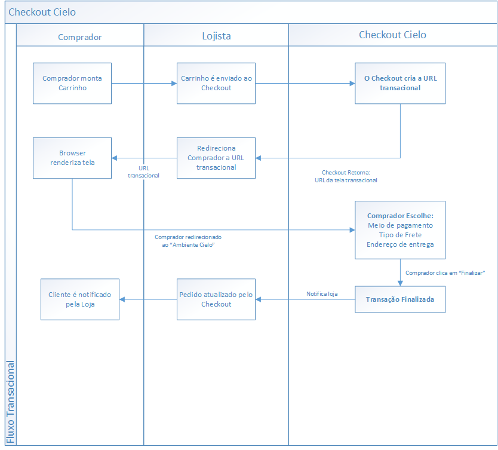
 
Após o portador do cartão (consumidor) selecionar suas compras e apertar o botão “Comprar” de uma loja já integrada ao Checkout Cielo, o fluxo nesta ordem:
 
1. A API da Cielo retorna o **CheckoutURL**, que é a URL da tela transacional montada com base nos dados enviados pelo Lojista/Botão. 
2. A loja redireciona o cliente para a URL retornada pela Cielo. A tela apresentada é parte do **Ambiente de pagamento seguro Cielo**.
3. O portador escolhe: Meio de pagamento, tipo de frete e endereço de entrega na tela transacional
4. O Checkout Cielo redireciona o cliente para a **URL de Retorno** escolhida pela loja, configurada no [Backoffice Checkout Cielo](/Checkout-Backoffice/)ou enviada pela integração via API.
5. Se a loja possui uma **URL de notificação**, ela será notificada sobre a situação da transação.
5. A loja avisa ao cliente que o processo foi concluído e que ele receberá mais informações sobre a compra e o pagamento por e-mail.e
7. A loja processa o pedido de compra utilizando os dados do POST de notificação e, se a transação estiver autorizada, libera o pedido.
 
**OBS:** O Checkout Cielo não notifica os compradores a respeito do status de compra, apenas ao lojista. Isso ocorre pois permite ao lojista decidir quando e como informar aos seus consumidores sobre o prazo de entrega e processo de envio

## Modo de teste do Checkout Cielo

O modo de teste Checkout Cielo é uma ferramenta que permite testar a integração do seu site com a plataforma. Com o modo teste, você pode realizar transações a medida que evolui com a integração e consegue simular cenários para testar diferentes meios de pagamento.

### Ativação do Modo de Teste.

O modo de teste pode ser ativado na aba **Configurações**, onde existe um caixa de seleção, que quando marcada, habilitará o modo de teste do Checkout Cielo. O modo somente se iniciará quando a seleção for salva.
 
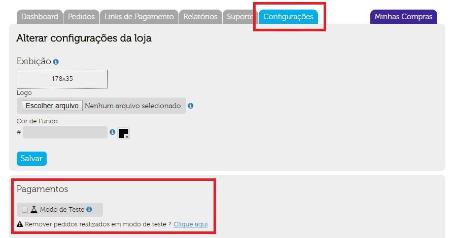
 
Quando a opção for salva, uma tarja vermelha será exibida na parte superior da tela. Ela será exibida em todas as telas do [Backoffice Cielo Checkout](http://developercielo.github.io/Checkout-Backoffice/) e na tela transacional do Checkout Cielo.
 
Essa tarja indica que a sua loja Checkout Cielo está agora operando em ambiente de teste, ou seja, toda a transação realizada nesse modo será considerada como teste.
 
| Backoffice                                                       | Transacional                                                         |
|------------------------------------------------------------------|----------------------------------------------------------------------|
| 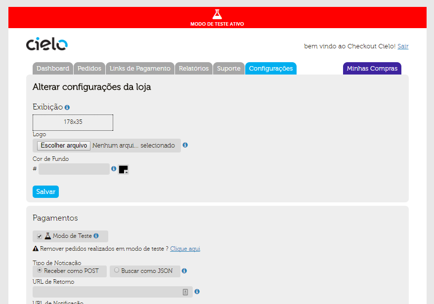 | 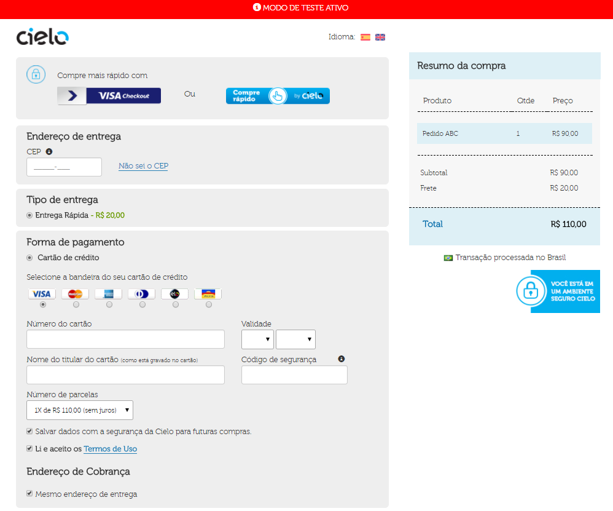 |

### Como transacionar no Modo de teste.

A realização de transações no modo de teste ocorre de forma normal. As informações da transação são enviadas via POST ou API, utilizando os parâmetros como descrito no tópico [Integração com carrinho](#integração-carrinho-de-compras), entretanto, os meios de pagamentos a serem usados serão meios simulados.
 
Para realizar transações de teste com diferentes meios de pagamento, siga as seguintes regras:
 
**A - Transações com Cartão de crédito:**
 
Para testar cartões de crédito é necessário que dois dados importantes sejam definidos, o status da autorização do cartão e o retorno da analise de fraude.
 
**Status da Autorização do Cartão de Crédito**
 
| Status da Transação   | Cartões para realização dos testes        | Código de Retorno | Mensagem de Retorno               |
|-----------------------|-------------------------------------------|-------------------|-----------------------------------|
| Autorizado            | 0000.0000.0000.0001 / 0000.0000.0000.0004 | 4                 | Operação realizada com sucesso    |
| Não Autorizado        | 0000.0000.0000.0002                       | 2                 | Não Autorizada                    |
| Não Autorizado        | 0000.0000.0000.0007                       | 77                | Cartão Cancelado                  |
| Não Autorizado        | 0000.0000.0000.0008                       | 70                | Problemas com o Cartão de Crédito |
| Não Autorizado        | 0000.0000.0000.0005                       | 78                | Cartão Bloqueado                  |
| Não Autorizado        | 0000.0000.0000.0003                       | 57                | Cartão Expirado                   |
| Não Autorizado        | 0000.0000.0000.0006                       | 99                | Time Out                          |
 
**Exemplo:** 540443424293010 **7** = **Autorizado**
 
**B - Boleto Bancário**
 
Basta realizar o processo de compra normalmente sem nenhuma alteração no procedimento. 
O boleto gerado no modo de teste sempre será um boleto simulado.
 
**C - Debito online**
 
É necessário informa o status da transação de Debito online para que seja retornado o status desejado. Esse processo ocorre como no antifraude do cartão de crédito descrito acima, com a alteração do nome do comprador.
 
**Status do Débito**
 
| Sobre nome do cliente | Status         |
|-----------------------|----------------|
| Pago                  | Pago           |
| Qualquer nome.        | Não autorizado |
 
* **Exemplo:** Status não Autorizado.
* **Nome do Cliente:** Maria Pereira
 
**D - Transações de teste**
 
Todas as transações realizadas no modo de teste serão exibidas como transações normais na aba Pedidos do Checkout Cielo, entretanto, elas serão marcadas como transações de teste e não serão contabilizadas em conjunto com as transações realizadas fora do ambiente de teste.
 
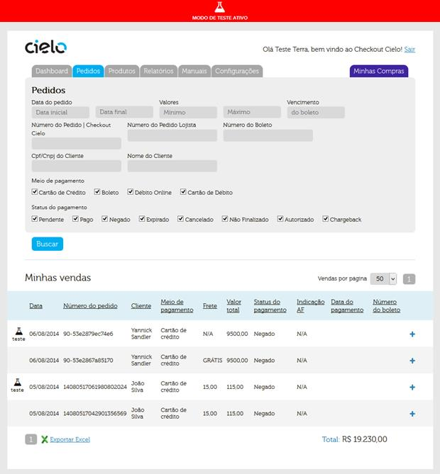
 
Essas transações terão o símbolo de teste as diferenciando de suas outras transações. Elas podem ser capturadas ou canceladas utilizando os mesmos procedimentos das transações reais.
 

 
<aside class="notice">É muito importante que ao liberar sua loja para a realização de vendas para seus clientes que **ela não esteja em modo de teste**. Transações realizadas nesse ambiente poderão ser finalizadas normalmente, mas **não serão descontadas do cartão do cliente** e não poderão ser “transferidas” para o ambiente de venda padrão.</aside>

## SDKs e POSTMAN

O Checkout Cielo possui uma coleção POSTMAN de testes exclusiva com todos os parametros e opções descritas neste manual.
Basta acessar nosso [Tutorial](https://developercielo.github.io/Tutorial//Postman) para obter informações sobre a utilização da ferramenta.

No postman é possivel criar exemplos de sua integração em:

* PHP
* RUBY
* C#
* JAVA
* PYTHON
* SHELL

## Integração por API

Este tipo de integração deve ser usada sempre que  houver  um  “carrinho  de  compras”  a  ser  enviado,  ou  seja,  no  caso  do consumidor navegar pelo site e escolher 1 ou mais produtos para adicionar a um carrinho e depois então finalizar a venda. 
 
Se você não possui um carrinho de compras implementado, veja a seção de **Integração via botão** Checkout Cielo.
 
Abaixo, é demonstrado como o fluxo de compra ocorre na integração via API:
 


### Criando o Carrinho

Na integração via API, a tela transacional é "montada" com bases em dados enviados que formam um **Carrinho de compras**.
Esses dados são separados nos seguintes "nós principais":
 
| Nó         | Descrição                                                                                                                                                 |
|------------|-----------------------------------------------------------------------------------------------------------------------------------------------------------|
| `Cart`     | Contem dados dos produtos a serem vendidos.                                                                                                               |
| `Shipping` | Contem dados do tipo de frete a ser cobrado. É influenciado pelo nó `Cart`                                                                                |
| `Payment`  | Contem informações que influenciam o valor cobrado. **Não contem informações sobre meios de pagamento**                                                   |
| `Customer` | Possui dados o comprador. Não obrigatório na integração, mas exigido na tela de pagamentos. Sugerimos que seja enviado para acelerar o processo de compra |
| `Options`  | Controla features opcionais do Checkout. Nó não obrigatório                                                                                               |
 
Após o envio dos dados do carrinho, o Checkout enviará um Response contendo um **LINK para a tela de pagamento**
 
**IMPORTANTE**: Uma chamada a API Checkout **NÃO CRIA UMA TRANSAÇÃO**. O Link retornado é apenas uma "pré-ordem" indicando que uma tela transacional está pronta para ser utilizada. A Transação é criada apenas quando o comprador clica em "FINALIZAR"

### Request

Endpoint é a URL para onde as requisições com os dados do carrinho serão enviadas. Todas as requisições deverão ser enviadas utilizando o método HTTP POST, para o endpoint:
 
<aside class="request"><span class="method post">POST</span> <span class="endpoint">https://cieloecommerce.cielo.com.br/api/public/v1/orders</span></aside>
  
**Exemplo de uma requisição**

```json
{  
   "OrderNumber":"Pedido01",
   "SoftDescriptor":"Exemplo",
   "Cart":{  
      "Discount":{  
         "Type":"Percent",
         "Value":00
      },
      "Items":[  
         {  
            "Name":"Produto01",
            "Description":"ProdutoExemplo01",
            "UnitPrice":100,
            "Quantity":1,
            "Type":"Asset",
            "Sku":"ABC001",
            "Weight":500
         },
        ]
   },
   "Shipping":{  
      "SourceZipCode":"20020080",
      "TargetZipCode":"21911130",
      "Type":"FixedAmount",
      "Services":[  
         {  
            "Name":"Motoboy",
            "Price":1,
            "Deadline":15,
            "Carrier":null
         },
         {  
            "Name":"UPS Express",
            "Price":1,
            "Deadline":2,
            "Carrier":null
         }
      ],
      "Address":{  
         "Street":"Rua Cambui",
         "Number":"92",
         "Complement":"Apto 201",
         "District":"Freguesia",
         "City":"Rio de Janeiro",
         "State":"RJ"
      }
   },
   "Payment":{  
      "BoletoDiscount":15,
      "DebitDiscount":10,
      "Installments":null,
      "MaxNumberOfInstallments": null
   },
   "Customer":{  
      "Identity":"84261300206",
      "FullName":"Test de Test",
      "Email":"test@cielo.com.br",
      "Phone":"21987654321"
   },
   "Options":{  
     "AntifraudEnabled":true,
     "ReturnUrl": "http://www.cielo.com.br"
   },
   "Settings":null
}
```

**Header/Cabeçalho**
 
| Campo          | Tipo         | Obrigatório | Tamanho | Descrição                                                                      |
|----------------|--------------|-------------|---------|--------------------------------------------------------------------------------|
| `MerchantId`   | Guid         | Sim         | 36      | Identificador único da loja. **Formato:** 00000000-0000-0000-0000-000000000000 |
| `Content-type` | Alphanumeric | Sim         | n/a     | Tipo do conteúdo da mensagem a ser enviada. **Utilizar:** "application/json"   |
 
**Cabeçalho e Autenticação** - Todas as requisições enviadas para a Cielo deverão ser autenticadas pela loja. A autenticação consiste no envio do `MerchantID`, que é o identificador único da loja fornecido pela Cielo após a afiliação da loja. A autenticação da loja deverá ser feita através do envio do campo de cabeçalho HTTP `MerchandId`, como ilustrado abaixo e ao lado:
 
**Body - Detalhado**

| Campo                      | Tipo         | Obrigatório | Tamanho | Descrição                                                                                           | Condicional                                                     |
|----------------------------|--------------|-------------|---------|-----------------------------------------------------------------------------------------------------|-----------------------------------------------------------------|
| `OrderNumber`              | Alphanumeric | Opcional    | 64      | Número do pedido da loja.                                                                           |                                                                 |
| `SoftDescriptor`           | Alphanumeric | Opcional    | 13      | Texto exibido na fatura do comprador. Sem caracteres especiais ou espaços. EX: `Loja_ABC_1234`      |                                                                 |
| `Cart.Discount.Type`       | Alphanumeric | Condicional | 255     | Tipo do desconto a ser aplicado: `Amount` ou `Percent`.                                             | Obrigatório caso Cart.Discount.Value for maior ou igual a zero. |
| `Cart.Discount.Value`      | Numeric      | Condicional | 18      | Valor do desconto a ser aplicado: Valor ou Percentual                                               | Obrigatório caso Cart.Discount.Type for `Amount` ou `Percent`.  |
| `Cart.Items.Name`          | Alphanumeric | Sim         | 128     | Nome do item no carrinho.                                                                           |                                                                 |
| `Cart.Items.Description`   | Alphanumeric | Opcional    | 256     | Descrição do item no carrinho.                                                                      |                                                                 |
| `Cart.Items.UnitPrice`     | Numeric      | Sim         | 18      | Preço unitário do produto em centavos. Ex: R$ 1,00 = 100                                            |                                                                 |
| `Cart.Items.Quantity`      | Numeric      | Sim         | 9       | Quantidade do item no carrinho.                                                                     |                                                                 |
| `Cart.Items.Type`          | Alphanumeric | Sim         | 255     | Tipo do item no carrinho: <BR>`Asset`<BR>`Digital`<BR>`Service`<BR>`Payment`<BR>                    |                                                                 |
| `Cart.Items.Sku`           | Alphanumeric | Opcional    | 32      | Sku do item no carrinho.                                                                            |                                                                 |
| `Cart.Items.Weight`        | Numeric      | Condicional | 9       | Peso em gramas do item no carrinho.                                                                 | Necessário caso Shipping.Type for "Correios".                   |
| `Payment.BoletoDiscount`   | Numeric      | Condicional | 3       | Desconto, em porcentagem, para pagamentos a serem realizados com boleto.                            |                                                                 |
| `Payment.DebitDiscount`    | Numeric      | Condicional | 3       | Desconto, em porcentagem, para pagamentos a serem realizados com débito online.                     |                                                                 |
| `FirstInstallmentDiscount` | Numeric      | Condicional | 3       | Desconto, em porcentagem, para pagamentos a serem realizados com crédito a vista.                   |                                                                 |
| `MaxNumberOfInstallments`  | Numeric      | Condicional | 2       | Define valor máximo de parcelas apresentadas no transacional, ignorando configuração do Backoffice  |                                                                 |
| `Customer.Identity`        | Numeric      | Condicional | 14      | CPF ou CNPJ do comprador.                                                                           | Não obrigatório na API, mas obrigatório na tela transacional    |
| `Customer.FullName`        | Alphanumeric | Condicional | 288     | Nome completo do comprador.                                                                         | Não obrigatório na API, mas obrigatório na tela transacional    |
| `Customer.Email`           | Alphanumeric | Condicional | 64      | Email do comprador.                                                                                 | Não obrigatório na API, mas obrigatório na tela transacional    |
| `Customer.Phone`           | Numeric      | Condicional | 11      | Telefone do comprador.                                                                              | Não obrigatório na API, mas obrigatório na tela transacional    |
| `Options.AntifraudEnabled` | Boolean      | Condicional | n/a     | Habilitar ou não a análise de fraude para o pedido: true ou false.                                  |                                                                 |
| `Options.ReturnUrl`        | Strin        | Condicional | 255     | Define para qual url o comprador será enviado após finalizar a compra.                              | Uma URL fixa pode ser registrada no Backoffice Checkout         |  

### Responses

Devido ao seu fluxo de venda ser dividido em duas etapas, sendo a primeira, a criação da tela transacional e a segunda, a finalização do pagamento; O Checkout possui duas respostas para uma transação:
 
* **Response - Tela transacional** - É o Response retornado com dados para enviar o comprador para a tela transacional
* **Response - Transação Finalizada** - Contém dados sobre o resultado da transação, após o comprador clica em "Finalizar" na tela transacional. **É retornado apenas via Notificação**
 
**Resultado/Status da transação:** Para obter o retorno do status da transação, é necessário definir uma URL de NOTIFICAÇÃO. Veja a sessão de notificação para maiores informações.
 
**Response - Tela transacional**

Existem apenas duas opções de resposta na integração da API: Sucesso / Erro

**Sucesso**:
Em caso de sucesso, o response será o conteúdo do Request mais o Link que direciona a tela transacional

> **SUCESSO** 

```Json
{
    "Settings": {
        "CheckoutUrl": "https://cieloecommerce.cielo.com.br/transacional/order/index?id=123",
        "Profile": "CheckoutCielo",
        "Version": 1
    }
}
```

| Campo         | Tipo   | Obrigatório | Tamanho | Descrição                                                                                                 |
|---------------|--------|-------------|---------|-----------------------------------------------------------------------------------------------------------|
| `CheckoutUrl` | String | Sim         | 255     | URL da tela transacional. O Comprador **deve ser direcionado a esse ambiente para finalizar a transação** |
| `Profile`     | String | Sim         | 16      | Perfil do lojista: fixo “CheckoutCielo”.                                                                  |
| `Version`     | String | Sim         | 1       | Versão do serviço de criação de pedido (versão: 1).                                                       |
  
**Erro**:
Em caso de erro, a mensagem abaixo será retornada.

> **ERRO**

```json
{
    "message":"An error has occurred."
}
```

| Campo     | Tipo   | Obrigatório | Tamanho | Descrição                   |
|-----------|--------|-------------|---------|-----------------------------|
| `Message` | String | Sim         | 254     | Mensagem descritiva do erro |
  
**Importante** - O Checkout Cielo não possui erros numerados, apenas uma mensagem genérica. Veja a sessão "Identificando erros de Integração" para maiores informações

### Funcionalidades Adicionais

Nos items a seguir, será explicado o comportamento de algumas das funcionalidades da integração via API. Essas funcionalidades possuem regras especificas para utilização e não estão disponíveis na integração via Botão.
 
* **Tipos de "Desconto"**
* **Tipos de "Frete"**

#### Tipos de "Desconto"

O Checkout Cielo permite que o lojista aplique descontos específicos tanto para o carrinho quanto para meios de pagamento.
Os descontos disponíveis no Checkout Cielo são:
 
| Desconto        | Aplicação        | Descrição                                                                                             |
|-----------------|------------------|-------------------------------------------------------------------------------------------------------|
| `Carrinho`      | API              | Quando enviado, aplica o desconto sobre todo o carrinho, independente do meio de pagamento            |
| `Boleto`        | API e Backoffice | Quando enviado, o desconto é aplicado somente caso o Boleto seja o meio de pagamento escolhido        |
| `Débito Online` | API e Backoffice | Quando enviado, o desconto é aplicado somente caso o Débito online seja o meio de pagamento escolhido |
| `A vista`       | API              | Quando enviado, o desconto é aplicado quando Cartão de crédito a vista é o meio de pagamento escolhido|
 
<aside class="notice">escontos podem ser enviados na API ou definidos no Backoffice. Caso um Valor de desconto seja enviado na API, esse será o valor considerado, mesmo que o Backoffice possua outro valor registrado </aside>
 
**Carrinho**
 
Para enviar um Desconto sobre o `Carrinho` basta enviar o nó abaixo dentro do nó `Cart`

```json
      {
       "Discount": {  
         "Type":"Percent",
         "Value":00
       },
      }
```

| Campo                 | Tipo         | Obrigatório | Tamanho | Descrição                                               | Condicional                                                     |
|-----------------------|--------------|-------------|---------|---------------------------------------------------------|-----------------------------------------------------------------|
| `Cart.Discount.Type`  | Alphanumeric | Condicional | 255     | Tipo do desconto a ser aplicado: `Amount` ou `Percent`. | Obrigatório caso Cart.Discount.Value for maior ou igual a zero. |
| `Cart.Discount.Value` | Numeric      | Condicional | 18      | Valor do desconto a ser aplicado: Valor ou Percentual   | Obrigatório caso Cart.Discount.Type for `Amount` ou `Percent`.  |
 
Abaixo, como o efeito do desconto são apresentados no Carrinho:
  
|Percentual|Valor|
|----------|-----|
|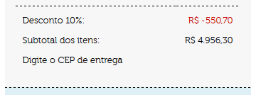|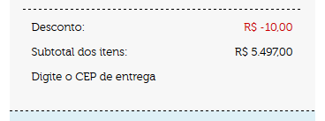|
  
**Boleto & Débito Online**
 
Para enviar um Desconto sobre o `Boleto` e `Débito online` basta enviar dentro do nó Payment os campos abaixo:

```json
      {
      "Payment": {  
        "BoletoDiscount":15,
        "DebitDiscount":10,
        "FirstInstallmentDiscount":90
        },
      }
```

| Campo                             | Tipo         | Obrigatório | Tamanho | Descrição                                                                                               | 
|-----------------------------------|--------------|-------------|---------|---------------------------------------------------------------------------------------------------------|
| `Payment.BoletoDiscount`          | Numeric      | Condicional | 3       | Desconto, em porcentagem, para pagamentos a serem realizados com boleto.                                | 
| `Payment.DebitDiscount`           | Numeric      | Condicional | 3       | Desconto, em porcentagem, para pagamentos a serem realizados com débito online.                         |
| `Payment.FirstInstallmentDiscount`| Numeric      | Condicional | 3       | Desconto, em porcentagem, para pagamentos a vista no Cartão de crédito                                  |
  
Abaixo, como o efeito do desconto são apresentados no Carrinho:
  
|Tela transacional|
|-----------------|
|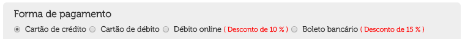|

#### Tipos de "Frete"

O Checkout cielo possui diferentes tipos de frete.

| Campo                   | Descrição                                                                                     |
|-------------------------|-----------------------------------------------------------------------------------------------|
| `FixedAmount`           | Valor fixo enviado pelo lojista. Utilizado caso o Lojista possua um método de entrega próprio |
| `Free`                  | Não realiza calculo de frete e exibe na tela transacional "Frete Grátis"                      |
| `WithoutShippingPickUp` | Considerado "Retirada na loja"                                                                |
| `WithoutShipping`       | Sem cobrança de frete (aplicável para serviços e produtos digitais).                          |
| `Correios` | Utiliza a API dos correios para realizar o calculo do custo. O valor do calculo dependerá o contrato utilizado (Escolhido no Backoffice do checkout) e do tipo de integração para calculo: **Frete com Volume** ou **Frete sem Volume** |
 
 Abaixo, como cada opção é demonstrada na tela transacional
 
| Tipo de frete           | Transacional                                                        |
|:-----------------------:|:-------------------------------------------------------------------:|
| `FixedAmount`           | 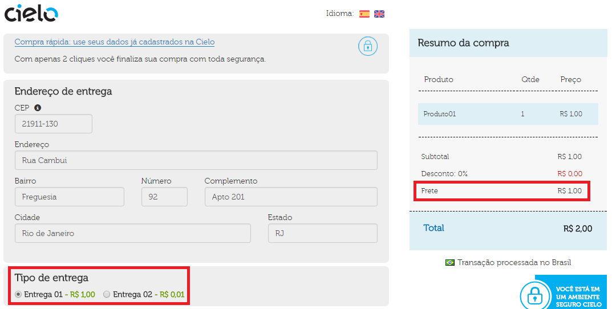                     |
| `Free`                  | 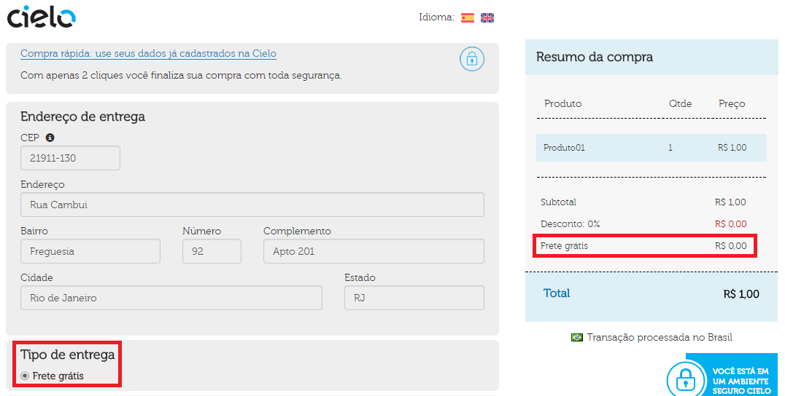                                   |
| `WithoutShippingPickUp` | 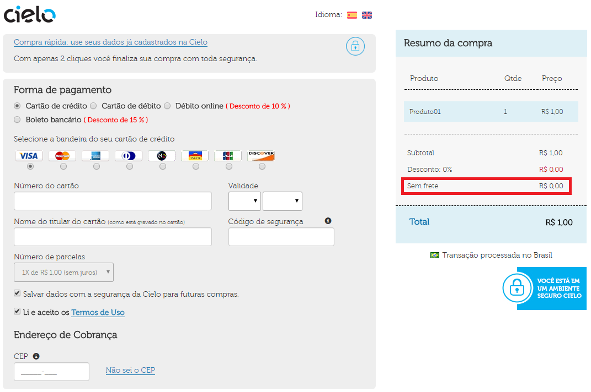 |
| `WithoutShipping`       |        |
| `Correios`              | 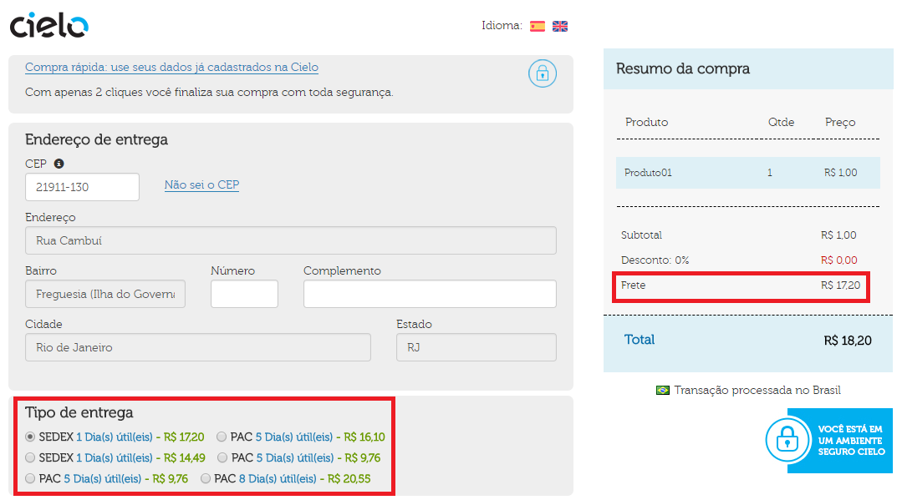                           |

 **OBS:** As opções para múltiplos fretes na categoria `Correios` devem ser selecionadas dentro do Backoffice Cielo.        
 
Os nós que formam as informações de frete abaixo:
 
* **Shipping** - Nó base. É obrigatório na integração via API. Ele define os tipos de frete a serem utilizados
 
| Campo                         | Tipo         | Obrigatório | Tamanho | Descrição                                                                                                    | Condicional                                                     |
|-------------------------------|--------------|-------------|---------|--------------------------------------------------------------------------------------------------------------|-----------------------------------------------------------------|
| `Shipping.Type`               | Alphanumeric | Sim         | 255     | Tipo do frete: <BR>`Correios`<BR>`FixedAmount`<BR>`Free`<BR>`WithoutShippingPickUp`<BR>`WithoutShipping`<BR> |                                                                 |
| `Shipping.SourceZipCode`      | Numeric      | Condicional | 8       | CEP de origem do carrinho de compras.                                                                        | Obrigatório caso Shipping.Type for "Correios".                  |
| `Shipping.TargetZipCode`      | Numeric      | Opcional    | 8       | CEP do endereзo de entrega do comprador.                                                                     |                                                                 |

**Shipping.Address** - Informações de endereço de entrega. **Não obrigatório no contrato da API, mas obrigatório na tela transacional**. Sugerimos que esses dados sejam enviados, se ja foram recolhidos dentro do ambiente da loja.
 
| Campo                        | Tipo         | Obrigatório | Tamanho | Descrição                                                        |
|------------------------------|--------------|-------------|---------|------------------------------------------------------------------|
| `Shipping.Address.Street`    | Alphanumeric | Sim         | 256     | Rua, avenida, travessa, etc, do endereço de entrega do comprador.|
| `Shipping.Address.Number`    | Alphanumeric | Sim         | 8       | Número do endereço de entrega do comprador.                      |                       
| `Shipping.Address.Complement`| Alphanumeric | Opcional    | 256     | Complemento do endereço de entrega do comprador.                 |                      
| `Shipping.Address.District`  | Alphanumeric | Sim         | 64      | Bairro do endereço de entrega do comprador.                      |
| `Shipping.Address.City`      | Alphanumeric | Sim         | 64      | Cidade do endereço de entrega do comprador.                      |                       
| `Shipping.Address.State`     | Alphanumeric | Sim         | 2       | Estado (UF) do endereзo de entrega do comprador.                 |  

**Shipping.Services**

| Campo                       | Tipo         | Obrigatório | Tamanho | Descrição                                                                                                    | 
|-----------------------------|--------------|-------------|---------|--------------------------------------------------------------------------------------------------------------|
`Shipping.Services.Name`      | Alphanumeric | Sim         | 128     | Nome do serviço de frete.                                                                                    |                       
`Shipping.Services.Price`     | Numeric      | Sim         | 18      | Preço do serviço de frete em centavos. Ex: R$ 1,00 = 100.                                                    |                    
`Shipping.Services.Deadline`  | Numeric      | Condicional | 9       | Prazo de entrega (em dias).                                                                                  |                         
 
O Frete Correios pode ser calculado de 2 maneiras: 
 
* **Frete com Volume** - Utiliza a API dos correios, mas exige que a loja envie as dimensões do pacote a ser enviado com as mercadorias
* **Frete sem Volume** - Utiliza a API dos correios, mas considera apenas o peso do carrinho como base de cálculo para a entrega.
 
Para utilizar o frete volumétrico, basta enviar o nó `Shipping.Measures`, seguindo as regras de integração via API REST.
 
**Shipping.Measures**
 
| Campo                         | Tipo         | Obrigatório | Tamanho | Descrição                                                                                                    | Condicional                                                     |
|-------------------------------|--------------|-------------|---------|--------------------------------------------------------------------------------------------------------------|-----------------------------------------------------------------|
| `Shipping.Package`            | Alphanumeric | Obrigatório | Inteiro | Tipo de pacote: <BR>`BOX`- Caixa <BR> `ROL` - Cilindro ou ENVELOPE                                           |                                                                 |
| `Shipping.Lenght`             | Numeric      | Obrigatório | Inteiro | Comprimento do pacote                                                                                        |                                                                 |
| `Shipping.Height`             | Numeric      | Condicional | Inteiro | Altura do pacote enviado                                                                                     | Obrigatório caso Shipping.Package como BOX                      |
| `Shipping.Width`              | Numeric      | Condicional | Inteiro | Largura do pacote.                                                                                           | Obrigatório caso Shipping.Package como BOX ou ENVELOPE          |
| `Shipping.Diameter`           | Numeric      | Condicional | Inteiro | Diâmetro do pacote.                                                                                          | Obrigatório caso Shipping.Package como ROL                      |
 
Para realizar o cálculo de frete via Correios é necessário respeitar as medidas definidas pelo contrato utilizado pelo lojista. Para maiores informações sobre as dimensões e pesos permitidos, sugerimos que valide o contrato da loja no link abaixo:
 
[Limites e dimensões para entregas do correio](http://www.correios.com.br/para-voce/precisa-de-ajuda/limites-de-dimensoes-e-de-peso)

### Identificando Erros de integração

Devido a estrutura do checkout Cielo, onde o comprador é redirecionado para um ambiente separado para completa a transação, existem possibilidades de erros e falhas de integração em diferentes momentos do fluxo de pagamento.
Durante a integração é importante 
Há dois tipos de erro que poderão ocorrer durante o processo de integração com o Checkout Cielo. São eles:
  
| Tipo de frete                 | Transacional                                                                                                                                                                                          |
|:-----------------------------:|:------------------------------------------------------------------------------------------------------------------------------------------------------------------------------------------------------|
| **Pré-Tela transacional**   | Significa que houve algum dado erra do no envio da transação. Dados obrigatórios podem estar faltando ou no formato invalido. Aqui o lojista sempre vai receber um e-mail informando o que deu errado |
| **Pós-Tela transacional**   | Significa que há algum impedimento de cadastro que limita a venda. Coisas como afiliação bloqueada, erro nos dados salvos no cadastro ou até problemas no próprio checkout                            |
 
Caso algum erro ocorra após a finalização da transação, entre em contato com o Suporte Cielo.

## Integração por BOTÃO

**Integração via Botão, QR CODE ou LINK** é um método de compra usada sempre que não houver um “carrinho de compras” em sua loja. 
Esse tipo de integração é realizado via o cadastro de um conjunto de itens a ser vendido on backoffice do Checkout Cielo.
 
O gera um do 3 tipos diferentes de métodos de acesso a **mesma tela transacional**:
 
| Método    |Nome| Descrição|
|-----------|:--:|----------|
|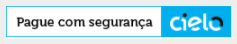|**Botão**|É um código HTML que ao ser colado em um site, vai direcionar o comprador a tela transacional - Ideal para uso em **hotSites** ou **E-mail Marketing** |
|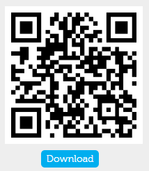   |**QRCODE**|Código interpretável por Smartphones e Tablets - Ideal para uso em **Marketing impressos** ou **Digital**|
|`http://bit.ly/2jwXJzE`|**LINK**|é um link compartilhável, ideal para uso em **Redes Sociais** ou **Messengers Mobile**|
 
Este modelo de integração é utilizado para:
 
* Associar uma compra rápida direta a um produto como uma promoção numa homepage pulando a etapa do carrinho.
* Enviar um e-mail marketing, ou uma cobrança via e-mail. 
* Adicionar o botão (HTML) referente ao produto/serviço a ser comprado/pago. 
* Realizar envio de pagamentos por aplicativos mobile
* Sempre que se deseja disponibilizar uma venda rápida.
  
Para utilizar este recurso, é necessário cadastrar o produto que se deseja vender, suas informações, e depois simplesmente copiar o código fonte gerado para este botão. A inclusão dos produtos é feita dentro do [Backoffice Cielo Checkout](http://developercielo.github.io/Checkout-Backoffice/), no menu de Produtos/Cadastrar Produto.

### Características do Botão

Cada botão possui um código único que só permite comprar aquele determinado produto nas condições de preço e frete cadastrado. Portanto, um fraudador não consegue alterar nenhuma destas informações na hora de submeter à compra, pois o Checkout Cielo vai buscar todos os dados do produto no cadastro do [Backoffice Cielo Checkout](http://developercielo.github.io/Checkout-Backoffice/), e valerão os dados do cadastro.
  
| Característica | Explicação |
|:--------------:|------------|
|**Especifico**| Cada botão gerado serve somente para um determinado produto ou grupo de produtos. A quantidade e volume de produtos vendido é definido no cadastro do Botão, não sendo possível altera a quantidade na tela transacional <BR><BR>**Exemplo:** Será necessário criar Um botão para vender 1 camisa. Se o comprador desejar 3 camisas, ele precisará usar o botão 2X ou O lojista deverá criar um botão com 2 camisas|
|**Numero do Pedido do Checkout**| O botão não permite o cadastro do número de pedido do Lojista. Como será a Cielo a acionar o próprio Checkout, será gerado um número de pedido (um `GUID`) único. O Lojista receberá esse número de pedido como link a venda realizada|
|**Criação de pedidos**|Um botão gera vários pedidos independentes, ou seja, não é possível limitar a quantidade de pedidos gerados por um botão, QRCODE ou Link criado. O Botão é um método de chamadas à API Checkout. Cada vez que ele é acionado, uma nova requisição é feita a API, criando assim um novo pedido| 
 
 **Abaixo, o fluxo de pagamento via Botão:**
 
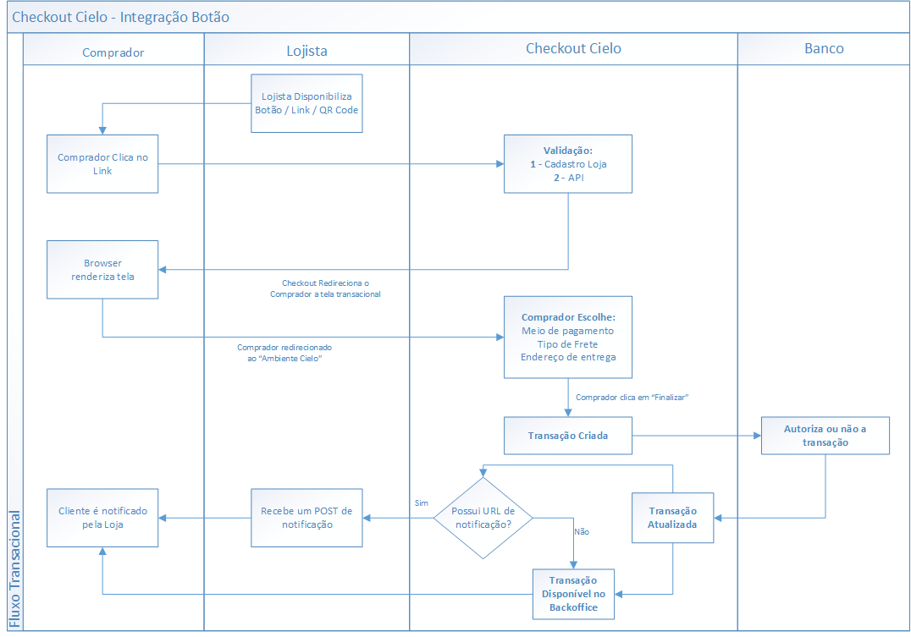

### Criando o Botão

Para utilizar este recurso, é necessário cadastrar o produto que se deseja vender, suas informações, e depois simplesmente copiar o código fonte gerado para este botão. A inclusão dos produtos é feita dentro do [Backoffice Cielo Checkout](http://developercielo.github.io/Checkout-Backoffice/), no menu de Produtos/Cadastrar Produto.
  
**Tela de Cadastro:**
 
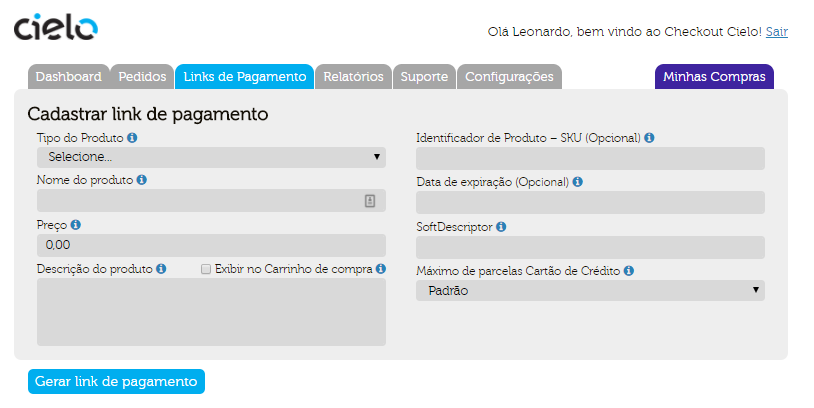
  
**Botão Cadastrado:**
 
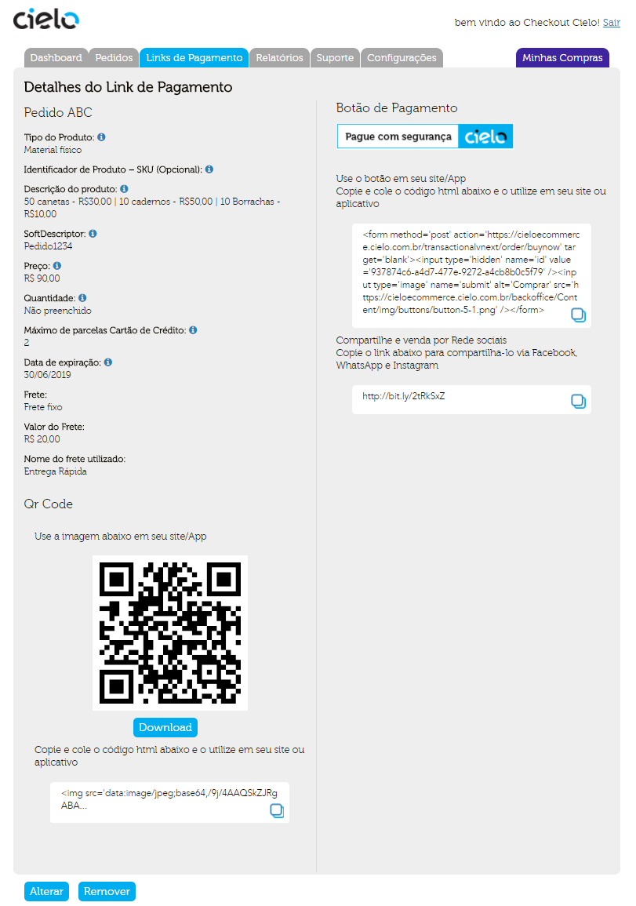
  
Abaixo a listagem de itens que devem ser cadastrados para a criação do botão:
  
| Campos          | Descrição                                                                                                                                      | Tamanho Min. | Tamanho Máx. | Obrigatório |
|-----------------|------------------------------------------------------------------------------------------------------------------------------------------------|--------------|--------------|-------------|
|`Tipo do Produto` | Indique se está vendendo um bem Material, um Serviço ou um bem Digital. Para bens Digitais, não será apresentada a opção de tipo de Frete.     | n/a          | n/a          | Sim         |
|`SKU`             | Código de identificação do produto                                                                                                             | 1            | 50           | Não         |
|`Título`          | Titulo do Produto                                                                                                                              | 1            | 50           | Sim         |
|`Descrição`       | Descrição do Produto                                                                                                                           | 1            | 255          | Sim         |
|`Preço`           | Valor total do pedido **em centavos** (ex.: R$1,00 =100).                                                                                      | 11           | 14           | Sim         |
|`Frete`           | Escolher dentre uma das opções de Frete (Correios, Frete Fixo, Frete Grátis, Retirar na loja, Sem Cobrança).                                   | n/a          | n/a          | Sim         |
|`CEP de Origem`   | Esse campo só aparece para o frete tipo Correios, deve ser preenchido com o CEP de onde vai partir a mercadoria para fins de cálculo de frete. | 9            | 9            | Sim         |
|`Peso(kg)`        | Esse campo só aparece para o frete tipo Correios, deve ser preenchido com o peso do produto em kg para fins de cálculo de frete                | n/a          | n/a          | Sim         |
|`Valor do Frete`  | Esse campo só aparece para o frete tipo Frete Fixo, e deve ser preenchido com o valor que o lojista especificar para seus produtos.            | n/a          | n/a          | Sim         |
|`Método de envio` | Esse campo só aparece para Tipo Produto igual a Material Físico e Tipo de Frete igual a Frete Fixo.                                            | n/a          | n/a          | Sim         |
|`URL`             | Esse campo só aparece para Tipo Produto igual a Digital.                                                                                       | n/a          | n/a          | Sim         |

### Exemplo de Botão:

Abaixo é possível ver como o cadastro de um botão gera os 3 métodos de para acesso a tela transacional.
 
> **Botão** - Será criado um código HTML como o abaixo:

```
<form method='post' action='https://cieloecommerce.cielo.com.br/transactionalvnext/order/buynow' target='blank'><input type='hidden' name='id' value='3d94cb63-e5eb-42a2-be8b-0f2324f8e61b' /><input type='image' name='submit' alt='Comprar' src='https://cieloecommerce.cielo.com.br/backoffice/Content/img/buttons/button-5-1.png' />
</form>
```

**Exemplo de um botão Funcional:**
 
<form method='post' action='https://cieloecommerce.cielo.com.br/transactionalvnext/order/buynow' target='blank'><input type='hidden' name='id' value='937874c6-a4d7-477e-9272-a4cb8b0c5f79' /><input type='image' name='submit' alt='Comprar' src='https://cieloecommerce.cielo.com.br/backoffice/Content/img/buttons/button-5-1.png'/></form>
 
* **QR CODE E LINK** - O link e o QRCODE tem o mesmo comportamento do botão, levando a mesma tela transacional.
 
|QR Code|Link  |
|:-----:|:----:|
|<img src='data:image/jpeg;base64,/9j/4AAQSkZJRgABAQAAAQABAAD/2wBDABALDA4MChAODQ4SERATGCgaGBYWGDEjJR0oOjM9PDkzODdASFxOQERXRTc4UG1RV19iZ2hnPk1xeXBkeFxlZ2P/2wBDARESEhgVGC8aGi9jQjhCY2NjY2NjY2NjY2NjY2NjY2NjY2NjY2NjY2NjY2NjY2NjY2NjY2NjY2NjY2NjY2NjY2P/wAARCADIAMgDASIAAhEBAxEB/8QAGwAAAgMBAQEAAAAAAAAAAAAABgcABAUDAgj/xABLEAABAgUCAgQICgkDBAEFAAABAgMABAUREgYTFCEVMTZRBxYiQVV0stIXMmFxg5GUo7PRJCVDVGWBkqTiI0VSJiehwjdCR3KFw//EABQBAQAAAAAAAAAAAAAAAAAAAAD/xAAUEQEAAAAAAAAAAAAAAAAAAAAA/9oADAMBAAIRAxEAPwABbbW64lttClrWQlKUi5UT1ACL3QVY9FT32df5RNP9oaZ6217Yh0T89L06Tcm5xzbYbtkrEm1yAOQ59ZEAl+gqx6Knvs6/yidBVj0VPfZ1/lDQ8dtO+kPuXPdieO2nfSH3LnuwCv6CrHoqe+zr/KKLja2nFNuIUhaCUqSoWKSOsEQ9pCel6jJtzcm5uMOXxViRexIPI8+sGEvqDtDU/W3fbMA4q42t2hVBttClrXLOJSlIuVEpNgBC10lITlM1HKTlQlH5SVbzzefbLaE3QoC6jyFyQP5w1Jh9uWl3Zh5WLTSCtarXsALk8oE69W6dqOjv0mkTHEz0xjttYKRlioKPNQAHJJPMwFXwiVKQnKEw3KTss+sTKVFLTqVEDFXOwPyxR8Gs/JyXSXGTbEvntY7rgRlbO9r/ADiBup6dqtIl0zE/K7LSlhAVuJVzsTbkT3GMuAfUrNy042XJSYafQDiVNLCgD3XHzx2gP8GPZ6Y9bV7CI2J/VNGp045KTk5tvt2yTtLNrgEcwLdREAAuU2fa1sqcckplEqiol1T6mlBCUBy5UVWta3O/VaGN07R/Ssj9oR+cY9Q1TRqnTpmQkpzdmpppbLKNpaclqBCRciwuSOuF/P6WrNOk3Juck9thu2St1BtcgDkDfrIgGx07R/Ssj9oR+cWJSfk53Pg5tiYwtltOBeN+q9vmMJOmUudq8wqXkGd51KCspyCeVwL8yO8QaaV/6O4rxh/Q+Lw2f2meOWXxL2tknr74Dj4RKbPzldYclJKZfQJZKSpppSgDkrlcD5YCX2HpZ5TMw04y6n4yHElKh5+YMPCmVSSq8uqYkHt5pKygqxKedgbcwO8QB6t0tWajqObm5OT3GHMMVbqBeyEg8ib9YMAcaf7PUz1Rr2BCRbbW64lttClrWQlKUi5UT1ACHlR2HJajSMu8nF1qXbQtN72ISARyhN6f7Q0z1tr2xAToKseip77Ov8onQVY9FT32df5Q6J+el6dJuTc45tsN2yViTa5AHIc+siMfx2076Q+5c92AV/QVY9FT32df5ROgqx6Knvs6/wAoaHjtp30h9y57sbEhPS9Rk25uTc3GHL4qxIvYkHkefWDAIlxtbTim3EKQtBKVJULFJHWCIkXtQdoan6277ZiQE0/2hpnrbXtiGhrvshPfR/iJhX6f7Q0z1tr2xDQ132Qnvo/xEwCfiRIkA4NCdkJH6T8RUK/UHaGp+tu+2YaGhOyEj9J+IqFfqDtDU/W3fbMA5qpLLnKVOSrZSFvsLbSVdQJSQL/XADIabnNIzjdcqDjDsrK3zQwoqWcgUCwIA61DzwwKhNcFTpmbwz2GluY3tliCbX/lAP4z+OP6g4Pg+L/b7u5hj5fxbC98bdfngKOsdWSFepTUrKMzKFofDhLqUgWCVDzE98BsMD4Mv4v/AG3+cD+qtMeLnC/pnE8Rn+ywxxx+U3+NAaWjtWSFBpTsrNszK1rfLgLSUkWKUjzkd0dp/Tc5q6ccrlPcYalZq2CH1FKxiAg3ABHWk+eM/TGj/GCnOTfHcPg6W8dnO9gDe+Q74ZFBpnQ1HYkN7e2svLxxvdRPVc98AE0vQNVk6rJzTkxJlDD6HFBK1XICgTbyfkgy1LTXqvQpmRl1NpddxxLhITyUDzsD3RcqE1wVOmZvDPYaW5je2WIJtf8AlAP8Jv8ACP7n/CA50ymvaDmFVSqqbeYdQZdKZUlSgokKucgkWsg+fujpVf8AuBtdEf6HA33OL8m+drWxy/4Hrt5ox9T6w8YKc3KcDw+Docy3s72BFrYjvivpXU/i5xX6HxPEYftcMccvkN/jQDC0dRJmg0p2Vm1tLWt8uAtEkWKUjzgd0catrWm0ipOyMwxNqdatkW0JKeYB5XUO+MP4Tf4R/c/4RPFjxx/X/GcHxf7Da3MMfI+NcXvjfq88AdScyickmJpsKCH20uJCusAi4v8AXCV0/wBoaZ6217Yh0U+V4KnS0pnnsNIbytbLEAXt/KEvp/tDTPW2vbEA0Nd9kJ76P8RMJ+HBrvshPfR/iJhPwEhwaE7ISP0n4ioT8ODQnZCR+k/EVAK/UHaGp+tu+2YkTUHaGp+tu+2YkBNP9oaZ6217Yh0T8jL1GTclJxvcYctknIi9iCOY59YEIltxbTiXG1qQtBCkqSbFJHUQYvdO1j0rPfaF/nANDxJ076P++c96J4k6d9H/AHznvQr+nax6VnvtC/zidO1j0rPfaF/nAOiQkZenSbcpJt7bDd8U5E2uSTzPPrJhL6g7Q1P1t32zE6drHpWe+0L/ADii44t1xTji1LWslSlKNyonrJMA+phhuZl3Zd5OTTqChab2uCLEcoy5DS1Gp043Nycntvt3xVurNrgg8ibdRMWq44tqhVBxtakLRLOKSpJsUkJNiDC50XVqlM6pkmZioTbzSs8kOPKUk+Qo8wTAGGuqpO0ijMzEg9suqmEoKsQrlio25g9wjD0r/wBY8V4w/pnCYbP7PDLLL4lr3xT190aHhO7PS/rafYXGf4K/90+i/wDeANKZS5KkS6peQZ2WlLKynIq52AvzJ7hAHq3VNZp2o5uUk5zbYbwxTtINroSTzIv1kx68IlSn5OusNyk7MsIMslRS06pIJyVzsD8kb2kpCTqenJScqEoxNzTmebz7YcWqy1AXUeZsAB/KAA5jWFdmZd2XensmnUFC07KBcEWI5JjDjc2GfHrh9pvY6Tw28Rjju2tbqtblaDjWlJpstpadel6fKMupwxW2ylKh5aRyIEAq4MNAUSnVnj+kJfe2tvDy1JtfK/UR3COPg7lJacrr7c3LtPoEspQS6gKAOSedj88a2v8A9ScB0R+r97c3OE/0s7Y2vja9rnr7zAEHiTp30f8AfOe9GxISMvTpNuUk29thu+KcibXJJ5nn1kwO+DubmZyhPuTcw6+sTKkhTqyogYp5XPzwK60q1SltUzrMvUJtlpOGKG3lJSPISeQBgGpCP0/2hpnrbXtiHFQ3Fu0KnuOLUta5ZtSlKNyolIuSYR7bi2nEuNrUhaCFJUk2KSOogwD2n5GXqMm5KTje4w5bJORF7EEcxz6wIx/EnTvo/wC+c96Ff07WPSs99oX+cTp2selZ77Qv84BoeJOnfR/3znvRsSEjL06TblJNvbYbvinIm1ySeZ59ZMJfp2selZ77Qv8AOJ07WPSs99oX+cBNQdoan6277ZiRRccW64pxxalrWSpSlG5UT1kmJAP6JGHL6woUzMNS7M9k66sIQnZWLkmwHNMak/PS9Ok3Jucc22G7ZKxJtcgDkOfWRAWIkZdM1FSqvMKl5Ca3nUoKynbUnlcC/MDvEdKrW6dRtrpCY2d2+HkKVe1r9QPeIDo/VqbLPKZmKhKMup+Mhx5KVDz8wTHPp2j+lZH7Qj84U+rZ6XqOo5ubk3NxhzDFWJF7ISDyPPrBjpL6PrszLtTDMjk06gLQreQLgi4PNUA1q42t2hVBttClrXLOJSlIuVEpNgBC50XSalLapknpinzbLSc8luMqSkeQocyRDUiQAr4RJSZnKEw3KS7r6xMpUUtIKiBirnYfPGToD9Scf0v+r97b2+L/ANLO2V7ZWva46u8QwIX/AIVP9r+l/wDSAMOnaP6VkftCPzhV60fZmdUzr0u6280rDFbagpJ8hI5ERXpmnarV5dUxISu80lZQVbiU87A25kd4i54k6i9H/fN+9AZfRNS4fiOj5vYwz3NlWONr3va1rc7xThyTDDktoV2XeTi61TChab3sQ1YjlCjkJGYqM43KSbe4+5fFOQF7Ak8zy6gYDzKykzOOFuUl3X1gZFLSCogd9h88Wugqx6Knvs6/yg00Lp2q0isvTE/K7LSpdSArcSrnkk25E9xgsqtbp1G2ukJjZ3b4eQpV7Wv1A94gMXwdykzJ0J9ubl3WFmZUoJdQUkjFPOx+aBXWlJqUzqmdel6fNvNKwxW2ypST5CRyIEMimVSSq8uqYkHt5pKygqxKedgbcwO8RcgKNDbW1Qqe24hSFolm0qSoWKSEi4IiN1qlOuJbbqcmtayEpSl9JKieoAXi9CLo77ctWZGYeVi01MNrWq17AKBJ5QDwffZlmVPTDrbLSfjLcUEpHm5kxzlJ+Tnc+Dm2JjC2W04F436r2+YwH6t1TRqjpyblJOc3H3MMU7Sxey0k8yLdQMY+gK3TqNx/SExs7u3h5ClXtlfqB7xAMaaqUhJuBubnZZhZGQS66lJI77E/JHZh9mZZS9LutvNK+KttQUk+bkRC71PIzGrqi3P0Fvi5VtoMqXkG7LBJIsux6lD642KDW6dpyjsUmrzHDT0vluNYKXjkoqHNIIPJQPIwBE5WqU04ptypyaFoJSpKn0gpI6wReJC1qGlqzU6jMz8lJ7srNOreZXuoTkhRJSbE3FwR1xIDH0/2hpnrbXtiGhrvshPfR/iJhT0+a4Koy03hnsOocxvbLEg2v/KCiva66Zo78h0ds7uPl7+VrKB6sR3QGbo6ty1Bqrs1NodWhbBbAaAJuVJPnI7oIqr/ANwNroj/AEOBvucX5N87Wtjl/wAD1280L+CDSup/Fziv0PieIw/a4Y45fIb/ABoDLq1NepFSdkZhTanWrZFskp5gHlcDvg6pevqVJ0qTlXJecK2GENqKUJsSEgG3lfJHHxY8cf1/xnB8X+w2tzDHyPjXF7436vPE+DL+L/23+cAwIp1apM0imuz0wlxTTVsg2AVcyByuR3xcgf132Qnvo/xEwHqhaskK9OrlZRmZQtDZcJdSkCwIHmJ74q6103Oag4Lg3GEbGeW6oi+WNrWB7jAv4Me0Mx6or20Q0IADplSZ0HLqpdVS48+6szCVSoCkhJATY5FJvdB83dFz4R6P+7T39CPegf8ACd2hl/VE+2uA+AdVUmUTmkZyabCgh+QW4kK6wC2SL/XC10J2vkfpPw1QwP8A7ef/AKr/APlC/wBCdr5H6T8NUA4IF9a6bnNQcFwbjCNjPLdURfLG1rA9xjQ1PXfF+nNzfDcRm6G8c8LXBN72PdFfSup/GPiv0PhuHw/a55ZZfILfFgMOmVJnQcuql1VLjz7qzMJVKgKSEkBNjkUm90Hzd0GFJqTNXprU9LpcS07fEOABXIkc7E90LvwndoZf1RPtriUHXXQ1HYkOjt7ay8vfxvdRPVie+AaEIWTllzk6xKtlIW+4ltJV1Ak2F/rg6+E3+Ef3P+EB+n+0NM9ba9sQGpVtFVKkU12emH5RTTVsg2tRVzIHK6R3wNw8K9TOmaO/Ib2zu4+Xjlaygeq47oD/AIMv4v8A23+cBR0dqyQoNKdlZtmZWtb5cBaSkixSkecjujtP6bnNXTjlcp7jDUrNWwQ+opWMQEG4AI60nzxY+DL+L/23+cGFBpnQ1HYkN7e2svLxxvdRPVc98B2pcsuTpUnKuFJWwwhtRT1EhIBt9USLUSA+f41NNU1mr12WkZhTiWncsi2QFckk8rg90ZcEGhO18j9J+GqAMPg4o/7zPf1o92J8HFH/AHme/rR7sGEB+v63UaNwHR8xs7u5n5CVXtjbrB7zAY8/qSc0jOOUOntsOysrbBb6SpZyAWbkEDrUfNFf4R6x+7SP9C/eggoNEp2o6OxVqvL8TPTGW47mpGWKikckkAckgchGh4k6d9H/AHznvQAzS9fVWcqsnKuS8mEPvobUUoVcAqANvK+WCbXfZCe+j/ETHSX0fQpaYamGZHF1pYWhW8s2INweao5677IT30f4iYBY0KtzNBnVzUohpa1tlsh0EixIPmI7oY2itSTmoON4xthGxhjtJIvlle9ye4Qp4YHgr/3T6L/3gM/wndoZf1RPtri5prRVNq9Clp6Yfm0uu5ZBtaQnkojldJ7op+E7tDL+qJ9tcGGhOyEj9J+IqADapqyfk25ygtsyxlWAuTStSVZlAugEm9r2Hda/mijoTtfI/SfhqjnMMNzOunZd5OTTtTKFpva4LtiOUMyQ0tRqdONzcnJ7b7d8Vbqza4IPIm3UTAY/hO7PS/rafYXAPp/Uk5p/iODbYXv45bqSbY3taxHeYblTpclV5dMvPs7zSVhYTkU87EX5Ed5jL8SdO+j/AL5z3oDDplNZ15LqqlVU4y+0sy6UypCUlIAVc5BRvdZ8/dFz4OKP+8z39aPdjH1PPTGkai3IUFzhJVxoPKRiHLrJIJuu56kj6ox/HbUXpD7lv3YDJqksiTqs5KtlRQw+ttJV1kBRAv8AVHOTmVyc6xNNhJWw4lxIV1Eg3F/qhpU/S1GqdOlp+dk92ammkPPL3VpyWoAqNgbC5J6oWdHYbmazIy7ycmnZhtC03tcFQBHKAONNa1qVXrstIzDEolp3LItoUFckk8rqPdB5AfXqJTtOUd+rUiX4ael8dt3NS8clBJ5KJB5KI5iA/wAdtRekPuW/dgHBAHqXWtSpFdmZGXYlFNNY4lxCirmkHnZQ742NC1Sdq9GemJ97edTMKQFYhPLFJtyA7zFyf0tRqjOOTc5J7j7lslbqxewAHIG3UBAXqXMrnKVJzTgSFvsIcUE9QJSCbfXEhY1DVNZplRmZCSnNqVlXVsso2kKxQkkJFyLmwA64kBTo9CqXTMjxNKm9jiG9zcl1Y45C97i1rQ1OAo9M/TOEkZTb/bbaG8b8vjea97fzjQjH1bIzFR05Nykm3uPuYYpyAvZaSeZ5dQMBh66rrPQzPRVVb3+ITlwswMscVdeJva9v/EAf64rf79UNn/8AN3C/12vb/wAR0qenarSJdMxPyuy0pYQFbiVc7E25E9xgs8Ff+6fRf+8ASaLYeltLSTMw04y6nPJDiSlQ8tR5gwD1jxq6ZnuG6Z2OIc29vdxxyNrW5WtB5P6po1OnHJScnNt9u2SdpZtcAjmBbqIiv47ad9Ifcue7AdKxXab0NPcNVZTf4dzb25hOWWJtaxve8L/TVWema7LM1moOPSKst1E28VNHySRkFG3Xa1/PaK8xo+uy0u7MPSOLTSCtat5BsALk8lRlyEjMVGcblJNvcfcvinIC9gSeZ5dQMAdaxlKVOUppvT8vJvzQfClpkEJUsIxVckI52uR8l7R28GshOSXSXGSj8vntY7rZRlbO9r/OI56F07VaRWXpifldlpUupAVuJVzySbcie4wWVWt06jbXSExs7t8PIUq9rX6ge8QHOp9A8QnpXo3fwGPFbeWNz1Zc7Xv/AOYA690x0w/4vcd0Z5OzwGez8UZY4eT8bK9vPeKeuqpJVesszEg9vNJl0oKsSnnko25gd4gk0lqmjU7TkpKTk5tvt55J2lm11qI5gW6iIAVpdNqrVdk5ydkpxCETKHXn3mlAJAUCpSlEfOSTB9qWrMzNCmWaNUG3p5WO0iUeCnT5QJxCTfqve3mvGpUP1np6Z4L/AFeKlF7P/wBOWSDj19V7jrhf0GiVHTlYYq1Xl+GkZfLcdzSvHJJSOSSSeagOQgM//rD+OffQUaKn5yS43xjm35fPDY6QcKMrZZY5/Om9vkjY8dtO+kPuXPdgf1V/1jwvi9+mcJnvfs8Mscfj2vfFXV3QBhsUes/pG1Iz+PkbmKHbee1+ffe3ywq9aMMy2qZ1mXabZaThihtISkeQk8gILNMT0vpGnOSFec4SacdLyUYly6CAAbouOtJ+qMevUSo6jrD9WpEvxMjMY7buaUZYpCTyUQRzSRzEBly/jVw7XDdM7GA29vdxxtytbla0eqHRaq1Xae45TJxCETLalKUwoBIChck2hrUdhyWo0jLvJxdal20LTe9iEgEcosTD7ctLuzDysWmkFa1WvYAXJ5QEfYZmWVMzDTbzSvjIcSFJPn5gxlzchpuSw4yUpUvnfHdbbRlbrtf5xFfx2076Q+5c92A/X9bp1Z4Do+Y3trcz8hSbXxt1gdxgDqVqWnpNstyk7TGEE5FLTraQT32B+SF7q2uznjHN9H1V/hfIw2Jg4fETe1jbrvAvEgGtS3NMO0qTcnV0hc0thCnlPForUspGRUTzve9787xIVMSAa0nr6lTk6xKty84FvuJbSVITYEmwv5XywVQh6fNcFUZabwz2HUOY3tliQbX/AJQyKDrrpmsMSHR2zu5eXv5WsknqxHdATwndnpf1tPsLjP8ABX/un0X/ALxoeE7s9L+tp9hcB+ldT+LnFfofE8Rh+1wxxy+Q3+NAEmpdFVKr12Znpd+US07jiHFqCuSQOdknujL+DisfvMj/AFr92ND4Tf4R/c/4RPhN/hH9z/hAG1UllzlKnJVspC32FtpKuoEpIF/rgBkNNzmkZxuuVBxh2Vlb5oYUVLOQKBYEAdah540Kf4Q+NqMtKdF4b7qG8uIvjkQL2x+WNjXfZCe+j/ETAeqFqyQr06uVlGZlC0Nlwl1KQLAgeYnvirrXTc5qDguDcYRsZ5bqiL5Y2tYHuML/AExXfF+ouTfDcRm0W8c8LXIN72PdDI0rqfxj4r9D4bh8P2ueWWXyC3xYBY12iTNBnUSs2tpa1thwFokixJHnA7o0qToqpVemtT0u/KJadviHFqCuRI52Se6DTU+j/GCotzfHcPg0G8dnO9iTe+Q742KDTOhqOxIb29tZeXjje6ieq574DtS5ZcnSpOVcKSthhDainqJCQDb6oq6lpr1XoUzIy6m0uu44lwkJ5KB52B7ouVCa4KnTM3hnsNLcxvbLEE2v/KBeg666ZrDEh0ds7uXl7+VrJJ6sR3QA/wDBxWP3mR/rX7saFK/7f7vS/wDr8dbb4TyrYXvfLH/mOq/ngo1PXfF+nNzfDcRm6G8c8LXBN72PdC31Vqfxj4X9D4bh8/2ueWWPyC3xYDcqdNe15MJqlKU2yw0gS6kzRKVFQJVcYhQtZY8/fBhpqmvUihS0jMKbU61lkWySnmonlcDvhd6Y1h4v05yU4HiM3S5lvYWuALWxPdDIoNT6Zo7E/s7O7l5GWVrKI67DugMWc19SpOdflXJecK2HFNqKUJsSDY28r5Iz6pr6lTlKnJVuXnAt9hbaSpCbAlJAv5Xyx6qHg842ozM30phvurcx4e+ORJtfL5Yr/Bl/F/7b/OAX8bGn9NzmoOI4NxhGxjluqIvle1rA9xgo+DL+L/23+cT/AOOf4jx/0O3h/Ve+fydUBn/BxWP3mR/rX7sT4OKx+8yP9a/dg40xXfGCnOTfDcPg6W8c872AN72HfGxAIWcllyc6/KuFJWw4ptRT1Eg2NvqiRa1B2hqfrbvtmJAcaXLInKrJyrhUEPvobUU9YBUAbfXB9P6bk9Iyblcp7j7s1K2wQ+oKQciEG4AB6lHzwD6f7Q0z1tr2xDQ132Qnvo/xEwC9rurJ+vSSJWbZlkIQ4HAWkqBuAR5ye+LWitNyeoON4xx9GxhjtKAvlle9we4Rz0LS5Kr1l6Xn2d5pMupYTkU88ki/IjvMMylUSnUbd6Pl9ndtn5alXte3WT3mAH/g4o/7zPf1o92J8HFH/eZ7+tHuxj6t1TWadqOblJOc22G8MU7SDa6Ek8yL9ZMY/jtqL0h9y37sAbSegaVJzrE03MThWw4lxIUtNiQbi/k/JFrXfZCe+j/ETAXR9YV2ZrMjLvT2TTsw2hadlAuCoAjkmGZPyMvUZNyUnG9xhy2SciL2II5jn1gQCHjY0/qSc0/xHBtsL38ct1JNsb2tYjvMEmutO0qkUZmYkJXZdVMJQVbilcsVG3MnuEAcA4tHVuZr1KdmptDSFofLYDQIFglJ85PfG9Af4Mez0x62r2ERj6t1TWadqOblJOc22G8MU7SDa6Ek8yL9ZMAcag7PVP1R32DCv0J2vkfpPw1RzmNYV2Zl3Zd6eyadQULTsoFwRYjkmOmhO18j9J+GqAMPCd2el/W0+wuFfD0qdLkqvLpl59neaSsLCcinnYi/IjvMLvX9Ep1G4Do+X2d3cz8tSr2xt1k95gPWjtJyFepTs1NvTKFofLYDSkgWCUnzg98dp/Uk5pGccodPbYdlZW2C30lSzkAs3IIHWo+aNjwY9npj1tXsIgP132vnvo/w0wGh8I9Y/dpH+hfvRPhHrH7tI/0L96A+JAGHwj1j92kf6F+9GPqDUk5qDh+MbYRsZY7SSL5Wve5PcIx4MNAUSnVnj+kJfe2tvDy1JtfK/UR3CAIPBj2emPW1ewiKepda1KkV2ZkZdiUU01jiXEKKuaQedlDvinqeemNI1FuQoLnCSrjQeUjEOXWSQTddz1JH1RsUGiU7UdHYq1Xl+JnpjLcdzUjLFRSOSSAOSQOQgOcvoqm1mXaqky/NofnUCYcS2tISFLGRAukm1z3mJBhLsNy0u1LspxaaQEITe9gBYDnEgKrdFpTTiXG6ZJoWghSVJYSCkjqINotPsMzLKmZhpt5pXxkOJCknz8wYQrba3XEttoUtayEpSkXKieoARe6CrHoqe+zr/KAc0rTZCTcLkpJSzCyMSpppKSR3XA+SLUI/oKseip77Ov8AKJ0FWPRU99nX+UA5H6TTZl5T0xT5R51XxluMpUo+bmSI59BUf0VI/Z0flCf6CrHoqe+zr/KKLja2nFNuIUhaCUqSoWKSOsEQDirFJpsrRp6YlqfKMvtS7i23G2UpUhQSSCCBcEHneFX07WPSs99oX+cO5xxDTanHFpQhAKlKUbBIHWSYGdWz8nU9OTcnT5tibmnMMGWHA4tVlpJskczYAn+UAN6FferNZel6q65PsJl1LS3NKLqQrJIuAq4vYkX+UwedBUf0VI/Z0flAHoVh6jVl6YqrTkgwqXUhLk0ktJKskmwKrC9gTb5DB507R/Ssj9oR+cBalZSWk2y3KS7TCCcilpASCe+w+aOL9Jpsy8p6Yp8o86r4y3GUqUfNzJEL/XTD1ZrLMxSmnJ9hMulCnJVJdSFZKNiU3F7EG3yiDDRbD0tpaSZmGnGXU55IcSUqHlqPMGAW+wz49cPtN7HSeG3iMcd21rdVrcrQeatkJOmacm5ynyjEpNN4YPMNhtabrSDZQ5i4JH84EXKbPta2VOOSUyiVRUS6p9TSghKA5cqKrWtbnfqtBdq2fk6npybk6fNsTc05hgyw4HFqstJNkjmbAE/ygFv07WPSs99oX+cGGgP13x/S/wCsNnb2+L/1cL5Xtle17Dq7hHHwd02fk66+5NyUywgyykhTrSkgnJPK5HyQxoDjKyktJtluUl2mEE5FLSAkE99h80KXXfa+e+j/AA0xoeE7tDL+qJ9tcB8A4qHRaU7Qqe45TJNa1yzalKUwklRKRck2i90FR/RUj9nR+UTT/Z6meqNewIVtDotVartPccpk4hCJltSlKYUAkBQuSbQBtrSk02W0tOvS9PlGXU4YrbZSlQ8tI5ECFnKT85JZ8HNvy+dstpwoyt1Xt85hsa77IT30f4iYF/BrPycl0lxk2xL57WO64EZWzva/ziADZqbmZxwOTcw6+sDEKdWVEDuufnjsxVqlLMpZl6hNstJ+Kht5SUjz8gDDulZuWnGy5KTDT6AcSppYUAe64+eO0BRobi3aFT3HFqWtcs2pSlG5USkXJMSL0SAR+n+0NM9ba9sQ6J+el6dJuTc45tsN2yViTa5AHIc+siEvp/tDTPW2vbENDXfZCe+j/ETATx2076Q+5c92J47ad9Ifcue7CfiQD4kJ6XqMm3Nybm4w5fFWJF7Eg8jz6wYS+oO0NT9bd9sw0NCdkJH6T8RUK/UHaGp+tu+2YByVhhyZo09Lspyddl3EITe1yUkAc4XdBolR05WGKtV5fhpGXy3Hc0rxySUjkkknmoDkIaEZ9epnTNHfkN7Z3cfLxytZQPVcd0AL6nnpfV1ObkKC5xc026HlIxLdkAEE3XYdah9cC/iTqL0f98370EHRnwf/AK23ukN79G2sdq1/KyvdX/C1reeCDSup/GPiv0PhuHw/a55ZZfILfFgOehaXO0ijPS8+zsuqmFLCcgrlikX5E9xgkgX1PrDxfqLcpwPEZtBzLewtckWtie6Mf4Tf4R/c/wCEBuVjUVKmZeepDM1lPOoclkNbahdwgpCbkW6+V72gToNEqOnKwxVqvL8NIy+W47mleOSSkckkk81AchGxT9H8bUZbUHHYb7qJ3Y2b45ELxyy+W17fygor1M6Zo78hvbO7j5eOVrKB6rjugOdM1FSqvMKl5Ca3nUoKynbUnlcC/MDvEdKrW6dRtrpCY2d2+HkKVe1r9QPeID+jPg//AFtvdIb36NtY7Vr+Vle6v+FrW88D+qtT+MfC/ofDcPn+1zyyx+QW+LAdNdVSSq9ZZmJB7eaTLpQVYlPPJRtzA7xA3BRpjR/jBTnJvjuHwdLeOznewBvfId8Y9epnQ1YfkN7e2sfLxxvdIPVc98AxKPrChS1GkZd6exdal20LTsrNiEgEckxc8dtO+kPuXPdhPwcVDwecFTpmb6Uz2GluY8PbLEE2vl8kBoat1TRqjpyblJOc3H3MMU7Sxey0k8yLdQMA9KolRrO70fL721bPy0pte9usjuMSg0zpmsMSG9s7uXl45WsknquO6GhpXTHi5xX6ZxPEYfssMccvlN/jQHPQtLnaRRnpefZ2XVTClhOQVyxSL8ie4wSQL6n1h4v1FuU4HiM2g5lvYWuSLWxPdGP8Jv8ACP7n/CAYESK9PmuNp0tN4Yb7SHMb3xyANr/ziQCX0/2hpnrbXtiGhrvshPfR/iJhX6f7Q0z1tr2xDon5GXqMm5KTje4w5bJORF7EEcxz6wIBDxIcHiTp30f98570TxJ076P++c96AmhOyEj9J+IqFfqDtDU/W3fbMOiQkZenSbcpJt7bDd8U5E2uSTzPPrJhL6g7Q1P1t32zAPCMvUtSepFCmZ6XS2p1rHEOAlPNQHOxHfGpA/rvshPfR/iJgBumVJ7Xkwql1VLbLDSDMJVKgpUVAhNjkVC1lnzd0Fmn9Nyen+I4Nx9e/jluqBtje1rAd5hR0yqTtImFTEg9suqQUFWIVyuDbmD3CNTx21F6Q+5b92A0PCd2hl/VE+2uLmmtFU2r0KWnph+bS67lkG1pCeSiOV0nui5piRl9XU5yfrzfFzTbpZSvIt2QACBZFh1qP1wYSEjL06TblJNvbYbvinIm1ySeZ59ZMACyerJ+TrrFBbZljKsTKZNK1JVmUBWAJN7XsO61/NDChJ1h9yW1VPTDKsXWp1xaFWvYhZIPOCTSWqazUdRykpOTm4w5nknaQL2QojmBfrAgNjwndnpf1tPsLhXw9KnS5Kry6ZefZ3mkrCwnIp52IvyI7zGX4k6d9H/fOe9AZ/gx7PTHravYRFyraKptXqTs9MPzaXXbZBtaQnkAOV0nujYplLkqRLql5BnZaUsrKcirnYC/MnuEAerdU1mnajm5STnNthvDFO0g2uhJPMi/WTACNUlkSdVnJVsqKGH1tpKusgKIF/qgql9a1KszDVLmWJRDE6sS7im0KCglZxJF1EXse4wSU/S1GqdOlp+dk92ammkPPL3VpyWoAqNgbC5J6ouS+j6FLTDUwzI4utLC0K3lmxBuDzVAYc/puT0jJuVynuPuzUrbBD6gpByIQbgAHqUfPGhorUk5qDjeMbYRsYY7SSL5ZXvcnuEWNd9kJ76P8RMK+lVuo0bd6PmNndtn5CVXte3WD3mAIPCd2hl/VE+2uA+LlTqk7V5hMxPvbzqUBAViE8rk25Ad5g80lpajVHTkpNzknuPuZ5K3Vi9lqA5A26gIAo0/2epnqjXsCJC3qGqazTKjMyElObUrKurZZRtIVihJISLkXNgB1xIAZbcW04lxtakLQQpKkmxSR1EGL3TtY9Kz32hf5xIkBOnax6VnvtC/zidO1j0rPfaF/nEiQE6drHpWe+0L/OKLji3XFOOLUtayVKUo3KieskxIkA/o5vsMzLKmZhpt5pXxkOJCknz8wYkSAp9BUf0VI/Z0flE6Co/oqR+zo/KJEgLUrKS0m2W5SXaYQTkUtICQT32HzQsdaVapS2qZ1mXqE2y0nDFDbykpHkJPIAxIkAVOU2Qd0SqcckpZc0unF1T6mklallu5UVWve/O/XeFaw+9LPJel3XGXU/FW2opUPNyIiRIA28HdSn5yuvtzc7MvoEspQS66pQByTzsT8sMaJEgFz4RKlPyddYblJ2ZYQZZKilp1SQTkrnYH5I3tJSEnU9OSk5UJRibmnM83n2w4tVlqAuo8zYAD+USJAAdYq1SlazPS8tUJtlhqYcQ2228pKUJCiAAAbAAcrR6odaqrtdp7blTnFoXMtpUlT6iFAqFwReJEgGFrvshPfR/iJhPxIkBIcGhOyEj9J+IqJEgNJyi0p1xTjlMk1rWSpSlMJJUT1km0SJEgP//Z'>| `http://bit.ly/2jwXJzE`|
  
Adicionando o botão na sua página HTML você deve copiar o código HTML do botão criado e colocar no código HTML do seu site, conforme o exemplo abaixo.
 
<aside class="notice">O código deve ser inserido dentro da área adequada no seu HTML.</aside>
 
Cada botão possui um código único que só permite comprar aquele determinado produto nas condições de preço e frete cadastrado. Portanto, um fraudador não consegue alterar nenhuma destas informações na hora de submeter a compra, pois o Checkout Cielo vai buscar todos os dados do produto no cadastro do [Backoffice Cielo Checkout](http://developercielo.github.io/Checkout-Backoffice/), e valerão os dados do cadastro.

#### Caso de Uso

Está é um exemplo de como usar a ferramenta de link / Qr code / Botão de pagamentos para elevar suas vendas! 

Para facilitar a leitura, vamos chamar essas opções de "LQB".

Primeiro, nos deixe explicar quais as diferenças entre essas 3 opções.  Em si, eles são 3 meios de acessar a nossa tela de pagamento sem necessariamente uma integração técnica com APIs etc. 

* **Link** - é uma url encurtada que pode ser enviada via redes sociais. Muito prático para acesso via computadores!
* **QR Code** - é a uma imagem que quando lida por um aparelho com leitor QR code (um APP no celular por exemplo), leva o comprador para a tela de pagamento. Ótimo para publicidade impressa!
* **Botão** - é uma Imagem embutida em código HTML para ser usada em um site. Muito bom caso você possua um site, mas não quer lidar com a criação de carrinhos ou fluxos de pagamento. Coloque em seu site e pronto, o botão leva os compradores para a tela de pagamentos

O LQB está disponível quando você registra um carrinho no backoffice do Checkout Cielo.
Basta seguir o caminho abaixo:

Acesso de lojista no site Cielo >  Vendas Online >  Checkout Cielo > ABA: Produtos >. Cadastrar produtos

Pronto! Após cadastrar você já tem um LQB esperando para ser usado!

Veja um exemplo de uso:

* Link + Recorrência:

A empresa PagBras realiza uma festa de aniversário com os funcionários todos os meses, regada a refrigerantes e salgadinhos, fornecidos pela própria companhia, que dizem, serem muito bons! 

Um dia os funcionários decidiram realizar uma "vaquinha" e contribuir mensalmente para que a variedade de petiscos e bebidas fosse maior, assim podendo fazer festas temáticas como festas juninas e de natal por exemplo.

O que eles fizeram? Sendo uma empresa antenada que não queria passar uma caixinha todos os meses para recolher a contribuição mensal, um dos funcionários criou uma recorrência via LQB, e em um grupo do Facebook da empresa, publicou o link de pagamentos. 

Hoje os funcionários contribuem mensalmente sem ter que lembrar de pagar, uma vez que a Recorrência do Checkout Cielo realiza uma nova transação de cobrança todos os meses!

## Fluxos Meios de pagamento

### Cartão de Crédito

O Checkout Cielo permite a utilização de Cartões de Crédito das principais bandeiras nacionais e internacionais. Esse meio de pagamento é liberado automaticamente junto a afiliação de Cielo, podendo ser utilizado inicialmente com a integração Checkout.
 
Transações de cartão de crédito serão incluídas no [Backoffice Cielo Checkout](http://developercielo.github.io/Checkout-Backoffice/) como PENDENTE, AUTORIZADO, PAGO, NEGADO, EXPIRADO OU CHARGEBACK dependendo do resultado da autorização junto ao Banco.
 
**Cartão de Crédito** Ordem de Status:
 
| Ordem | Status                  | Explicação                                                                                                                                                                                   |
|-------|-------------------------|----------------------------------------------------------------------------------------------------------------------------------------------------------------------------------------------|
| 1     | **PENDENTE**            | Status original. A transação está ocorrendo, esperando resposta do processo de autorização                                                                                                   |
| 2     | **AUTORIZADO / NEGADO** | Resultado do processo de autorização. <BR><BR>**AUTORIZADO** - Crédito foi reservado para a compra <BR> **NEGADO** - Cartão não autorizado pelo emissor a continuar a transação              |
| 3     | **PAGO**                | Ocorre pós captura. Indica que o crédito reservado no cartão será depositado na conta do lojista                                                                                             |
| N/A   | **EXPIRADO**            | Ocorre caso a transação não seja capturada em 15 dias pós autorização. Nessa situação a transação é perdida.                                                                                 |
| N/A   | **CHARGEBACK**          | Status não automatico. Caso o lojista seja notificado de ChargeBack, ele pode marcar esta transação como perdida.<br> Este Status é apenas uma marcação, não afetando processos de pagamento |
  
**Atenção - Cartões Internacionais:** O Checkout Cielo aceita cartões emitidos fora do Brasil, entretanto esses cartões não possuem a capacidade de pagar vendas parceladas. Essa é uma limitação imposta pelo banco emissor.
 
**Atenção - TRANSAÇÕES EXPIRADAS:** Por padrão, lojas Checkout Cielo possuem 15 dias para realizarem a captura da transação de Crédito. Se não capturadas, essas transações serão PERDIDAs.

### Análise de Fraude

Transações de crédito **“AUTORIZADAS”** serão enviadas para análise da ferramenta de antifraude caso o parametro `Options.AntifraudEnabled` esteja definido como `TRUE`. 
O Antifraude possui o conceito de `Status` e `SubStatus`, onde o primeiro representa o nivel de risco que uma transação possui de ser uma fraude, e o segundo, uma informação adicional sobre a transação.
A análise indicará um grau de *RISCO**, especificado pelo `Status`, para a venda em questão. 
Esse grau de risco é o que deve guiar a decisão do lojista de capturar ou cancelar a venda. 
 
| Status Antifraude | Substatus                | Descrição                                                                                                       |
|-------------------|--------------------------|-----------------------------------------------------------------------------------------------------------------|
| `Baixo Risco`     | Baixo Risco              | Baixo risco de ser uma transação fraudulenta                                                                    |
| `Médio Risco`     | Médio Risco              | Médio risco de ser uma transação fraudulenta                                                                    |
| `Alto Risco`      | Alto Risco               | Alto risco de ser uma transação fraudulenta                                                                     |
| `Não finalizado`  | Não finalizado           | Não foi possível finalizar a consulta                                                                           |
| `N/A`             | Autenticado              | Transações autenticadas pelo banco - **Não são analisáveis pelo AF**                                            |
| `N/A`             | AF Não contratado        | Antifraude não habilitado no plano do lojista - **Não são analisáveis pelo AF**                                 |
| `N/A`             | AF Dispensado            | Antifraude dispensado via contrato ou inferior ao valor mínimo de antifrade parametrizado backoffice no lojista |
| `N/A`             | Não aplicável            | Meio de pagamento não analisável como cartões de débito, boleto e débito online                                 |
| `N/A`             | Transação de recorrência | Transação de crédito seja posterior a transação de agendamento. **Somente o Agendamento é analisado**           |
| `N/A`             | Transação negada         | Venda a crédito foi negada - **Não são analisáveis pelo AF**                                                    |
  
A analise será apresentada no “Detalhes do Pedido”, como abaixo:
 

 
Você pode visualizar o status do antifraude acessando o detalhe da compra, na aba Pedidos e clicando no (+)
 
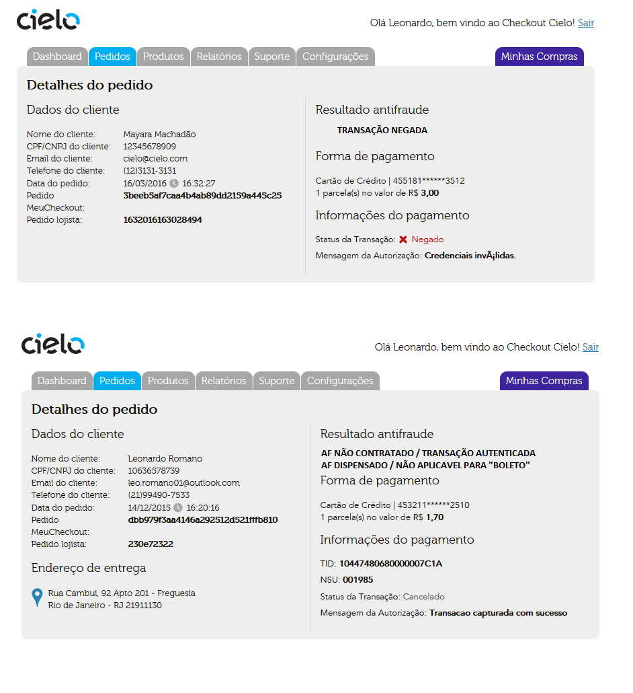

### Cartão de Débito

O Checkout Cielo permite a utilização de Cartões de débito MasterCard e Visa. Esse meio de pagamento é liberado automaticamente junto a afiliação de Cielo, podendo ser utilizado inicialmente com a integração Checkout.
 
Bancos Suportados:
 
| Mastercard      | Visa            |
|-----------------|-----------------|
| Bradesco        | Bradesco        |
| Banco do Brasil | Banco do Brasil |
| Santander       | Santander       |
| Itaú            | Itaú            |
| CitiBank        | CitiBank        |
| BRB             |       N/A       |
| Caixa           |       N/A       |                 
| BancooB         |       N/A       |                 
 
**OBS:** Cartões não pertencentes a esses bancos terão suas autorizações negadas.
 
Ao Acessar a tela transacional, o comprador obterá pelo pagamento via Cartão de débito, e será redirecionado ao ambiente bancário para Autenticação e Autorização.
 
Transações de cartão de débito serão incluídas no [Backoffice Cielo Checkout](http://developercielo.github.io/Checkout-Backoffice/) como PENDENTE, PAGO, NÃO AUTORIZADO ou NÃO FINALIZADO, dependendo do resultado da autorização junto ao Banco.
 
**Cartão de Débito** - Ordem de Status 
 
1. **Pendente** - Status original. A transação está ocorrendo, esperando resposta do banco para envio do comprador ao ambiente de autenticação
2. **Não Finalizado** - Status intermediário. Neste ponto o Checkout Cielo espera a confirmação do Banco sobre o status da autenticação e transação. Caso o comprador abandone o ambiente do banco, o status não se altera.
3. **Pago** - Comprador finalizou o pagamento com o cartão de débito com sucesso.
4. **Não Autorizado** - O Comprador não apresentava saldo em conta para finalizar a transação.
 
**OBS**: A opção **Cancelar** dentro do backoffice, vai modificar o status da transação de PAGO/NÃO PAGO para CANCELADO, mas não terá efeito sobre a movimentação bancaria. Caberá ao lojista retornar o valor ao comprador

### Boleto

O Checkout Cielo permite a utilização de Boletos do Bradesco (Carteira 26 e SPS) e Banco do Brasil (Carteira 18). 
Esse meio de pagamento precisa ser cadastrado pelo Suporte Cielo para que seja disponibilizado no Backoffice Checkout.
 
Bancos Suportados:
 
| Mastercard      | Visa            |
|-----------------|-----------------|
| Bradesco        | Bradesco        |
| Banco do Brasil | Banco do Brasil |
| Santander       | Santander       |
| Itaú            | Itaú            |
| CitiBank        | CitiBank        |
| BRB             |       N/A       |
| Caixa           |       N/A       |                 
| BancooB         |       N/A       |                 
 
**OBS:** Cartões não pertencentes a esses bancos terão suas autorizações negadas.
 
Ao Acessar a tela transacional, o comprador obterá pelo pagamento via Cartão de débito, e será redirecionado ao ambiente bancário para Autenticação e Autorização.
 
Transações de cartão de débito serão incluídas no [Backoffice Cielo Checkout](http://developercielo.github.io/Checkout-Backoffice/) como PENDENTE, PAGO, NÃO AUTORIZADO ou NÃO FINALIZADO, dependendo do resultado da autorização junto ao Banco.
 
**Cartão de Débito** - Ordem de Status 
 
1. **Pendente** - Status original. A transação está ocorrendo, esperando resposta do banco para envio do comprador ao ambiente de autenticação
2. **Não Finalizado** - Status intermediário. Neste ponto o Checkout Cielo espera a confirmação do Banco sobre o status da autenticação e transação. Caso o comprador abandone o ambiente do banco, o status não se altera.
3. **Pago** - Comprador finalizou o pagamento com o cartão de débito com sucesso.
4. **Não Autorizado** - O Comprador não apresentava saldo em conta para finalizar a transação.
 
**OBS**: A opção **Cancelar** dentro do backoffice, vai modificar o status da transação de PAGO/NÃO PAGO para CANCELADO, mas não terá efeito sobre a movimentação bancaria. Caberá ao lojista retornar o valor ao comprador

### Débito Online

O Checkout Cielo permite a utilização de Débito Online (Transferência entre contas bancarias) para compradores que possuam contas nos bancos Bradesco e Banco do Brasil.
Esse meio de pagamento é liberado via cadastro junto ao Suporte Cielo. 
 
Ao acessar a tela transacional, o comprador obterá pelo pagamento via Débito online, e será redirecionado ao ambiente bancário para Autenticação e Autorização.
 
Transações de Débito online serão incluídos no [Backoffice Cielo Checkout](http://developercielo.github.io/Checkout-Backoffice/) como PENDENTE, PAGO, NÃO AUTORIZADO ou NÃO FINALIZADO, dependendo do resultado da autorização junto ao Banco.
 
**Débito online** - Ordem de Status 
 
* **Pendente** - Status original. A transação está ocorrendo, esperando resposta do banco  para envio do comprador ao ambiente de autenticação
* **Não Finalizado** - Status intermediário. Neste ponto o Checkout Cielo espera a confirmação do Banco sobre o status da autenticação e transação. Caso o comprador abandone o ambiente do banco, o status não se altera.
* **Pago** - Comprador finalizou o pagamento do débito com sucesso.
* **Não Autorizado** - O Comprador não apresentava saldo em conta para finalizar a transação.
 
**OBS**: A opção **Cancelar** dentro do backoffice, vai modificar o status da transação de PAGO/NÃO PAGO para CANCELADO, mas não terá efeito sobre a movimentação bancaria. Caberá ao lojista retornar o valor ao comprador

# Notificações de Pagamento

O processo de notificação transacional no Checkout Cielo ocorre via a inclusão de uma URL para onde serão direcionados dados das transações realizadas na plataforma.
Vale destacar que o Checkout realiza a notificação somente quando uma transação é considerada finalizada ou seja, o comprador preencheu todos os dados da tela de pagamento e clicou em "Finalizar".

## Tipos de notificação

O Checkout Cielo possui dois tipos de notificações que o lojista pode utilizar de acordo com suas necessidades:
 
|Tipo|Descrição|
|----|---------|
|`POST`| Notificação onde o lojista é passivo. Dois `POST HTTP` são disparados, um informando dados da venda e outra mudança de Status da transação|
|`JSON`| Notificação onde o lojista realiza uma consulta. Um `POST` contendo informações para a realização de uma consulta (`GET`) as transações checkout |
 
Para utilizar ambos os modelos, o lojista necessitará acessar o Backoffice cielo e configurar tanto a `URL de NOTIFICAÇÃO` quando a `URL de MUDANÇA de STATUS`.

## Tipos de URL de Notificação

O Checkout possui 3 tipos de URL que podem impactar o processo de notificação.
 
|Tipo|Descrição|Observação|
|----|---------|----------|
|`URL de Retorno` | Página web na qual o comprador será redirecionado ao fim da compra. <BR><BR>Nenhum dado é trocado ou enviado para essa URL.<BR><BR> Essa URL apenas leva o comprador, após finalizar a compra, a uma página definida pela loja.| Caso o Lojista deseje, ele pode configurar essa página para ser sensibilizada por tráfego, assim identificando que a transação foi finalizada no Checkout Cielo <BR><BR> Pode ser enviada via API - Ver "Integração por API"  |
|`URL de Notificação`|Ao finalizar uma transação é enviado um POST HTTP com todos os dados da venda para a URL de Notificação.<BR><BR> O POST de notificação é enviado apenas no momento que a transação é finalizada, independentemente se houve alteração do status da transação**| Utilizada na Notificação via `POST`e `JSON`|
|`URL de Mudança de Status`|Quando um pedido tiver seu status alterado, será enviando um post HTTP para a URL de Mudança de Status.<BR><BR> O POST de mudança de status não contem dados do carrinho, apenas dados de identificação do pedido|Utilizada somente na Notificação via `POST`|
 
**OBS:** Caso uma `URL de retorno` seja enviada vai API, ela terá prioridade sobre a URL cadastrada no Backoffice / Na integração Checkout Cielo `via Botão`, só é possível usar a opção de URL de retorno via backoffice.
 
**Características das URLs**
 
Todas as 3 URLs devem possuir as seguintes características:
 
* Devem ser URLs estáticas
* Devem possuir menos de 255 caracteres
* Caracteres especiais não são suportados
 
**Configurando as URLs**
 
1. Basta acessar dentro do **Backoffice** as Abas **Configurações**
2. Em **Configurações da Loja**, Vá a sessão de **Pagamentos**
3. Cadastre as URLS e escolhe o tipo de Notificação desejado
 
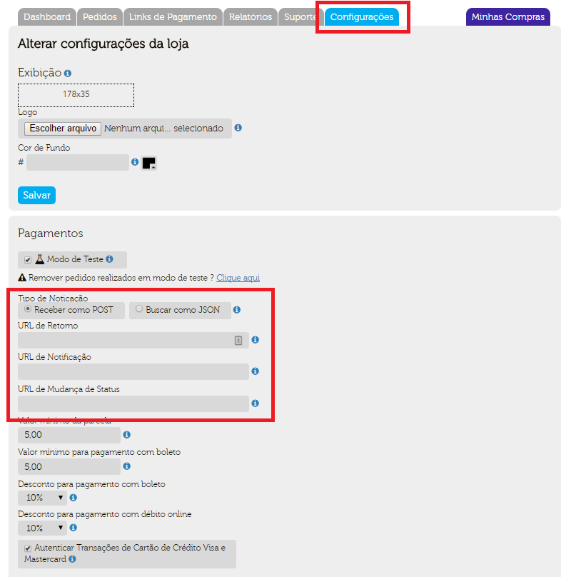

## Notificação: POST

A notificação via POST é baseada no envio de um `POST HTTP` quando uma transação é realizada. Ela é realizada em duas etapas:
 
1. `POST de NOTIFICAÇÃO` - Ocorre quando a transação é finalizada. Esse POST possui todos os dados do pedido, incluindo o STATUS inicial da transação.
2. `POST de MUDANÇA DE STATUS` - Ocorre quando uma transação possui seu STATUS alterado - **EX:** "Autorizado" > > > "Pago"
 
Este fluxo é utilizado por lojas que ainda não realizam transações via API. 
 
Abaixo o Fluxo de uma Notificação POST
 
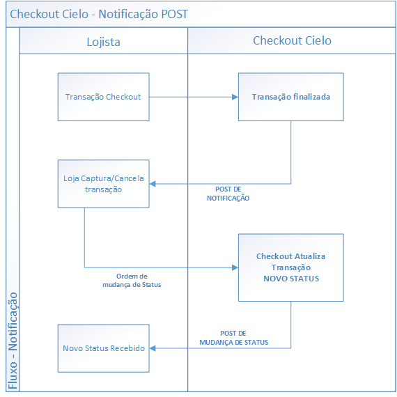
 
**Retorno aguardado para o envio da notificação:** `HttpStatus = 200 (OK)` - Post recebido e processado com sucesso
 
**IMPORTANTE** Se a `URL de Notificação` cadastrada retornar algum erro/estiver indisponível, serão realizadas **3 novas tentativas, com intervalo de 1 hora entre cada POST*. 
 
Caso o POST não seja recebido, é possível reenvia-lo manualmente, basta acessar o pedido em questão pelo Backoffice e clicar no Ícone de envio:
 
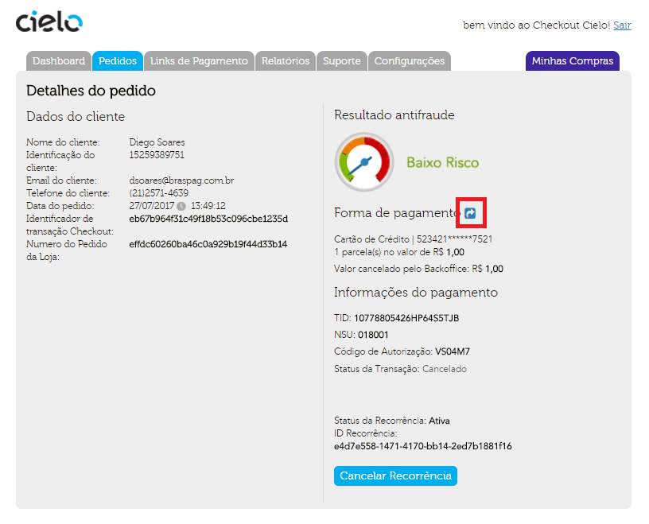
 
Veja a descrição dos itens de notificação na sessão **"Conteúdo do POST de NOTIFICAÇÃO"**

## Notificação: JSON

A notificação vai JSON é um método mais seguro e flexível para o lojista de realizar uma consulta no Chekcout Cielo.
Essa modalidade de notificação é baseada em um `POST JSON`, onde o lojista recebe credenciais para que uma consulta (`GET`) possa ser realizado junto a base de dados Checkout Cielo.
 
Ela é realizada em duas etapas:
 
1. `POST de NOTIFICAÇÃO` - Ocorre quando a transação é finalizada. Possui as Credenciais necessárias consultas transacionais.
2. `CONSULTA TRANSACIONAL` - Com as credenciais de consulta, o lojista busca dados da venda junto ao Checkout Cielo
 
Na Notificação de JSON, não há diferença entre o `POST de Notificação` e `Mudança de Status`. Sempre que algo ocorrer na transação, o lojista receberá um `POST de Notificação`
 
Abaixo o Fluxo de uma Notificação JSON (Criação da transação + Mudança de status)
 
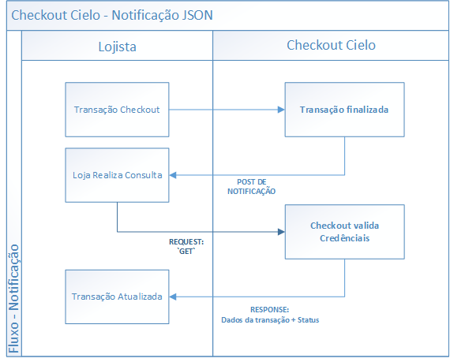
 
**Conteúdo do POST de NOTIFICAÇÃO JSON:**
 
| Parâmetro             | Descrição                                                                                                              | Tipo do Campo       |
|-----------------------|------------------------------------------------------------------------------------------------------------------------|---------------------|
| `URL`                 | URL com os dados necessários para realizar a busca dos dados da transação.                                             | String              |
| `MerchantId`          | Identificador da loja no Checkout Cielo; consta no Backoffice no menu Configuração/Dados Cadastrais.                   | Alfanumérico (GUID) |
| `MerchantOrderNumber` | Número do pedido da loja; se não for enviado, o Checkout Cielo gerará um número, que será visualizado pelo Consumidor. | Alfanumérico        |
 
**Exemplo de uma consulta:**
 
**REQUEST**

```html
--HEADER: MerchantID
 GET https://cieloecommerce.cielo.com.br/api/public/v1/orders/{merchantId}/{merchantOrderNumber}
```

**RESPONSE**

```json
{
    "order_number": "Pedido01",
    "amount": 101,
    "discount_amount": 0,
    "checkout_cielo_order_number": "65930e7460bd4a849502ed14d7be6c03",
    "created_date": "12/09/2017 14:38:56",
    "customer_name": "Test Test",
    "customer_phone": "21987654321",
    "customer_identity": "84261300206",
    "customer_email": "test@cielo.com.br",
    "shipping_type": 1,
    "shipping_name": "Motoboy",
    "shipping_price": 1,
    "shipping_address_zipcode": "21911130",
    "shipping_address_district": "Freguesia",
    "shipping_address_city": "Rio de Janeiro",
    "shipping_address_state": "RJ",
    "shipping_address_line1": "Rua Cambui",
    "shipping_address_line2": "Apto 201",
    "shipping_address_number": "92",
    "payment_method_type": 1,
    "payment_method_brand": 1,
    "payment_maskedcreditcard": "471612******7044",
    "payment_installments": 1,
    "payment_status": 3,
    "tid": "10447480686J51OH8BPB",
    "test_transaction": "False"
}
 
```

Veja a descrição dos itens de notificação na sessão **"Conteúdo do POST de NOTIFICAÇÃO"**
 
**Retorno aguardado para o envio da notificação:** `HttpStatus = 200 (OK)` - Post recebido e processado com sucesso
 
**IMPORTANTE** Se a `URL de Notificação` cadastrada retornar algum erro/estiver indisponível, serão realizadas **3 novas tentativas, com intervalo de 1 hora entre cada POST*. 
 
Caso o POST não seja recebido, é possível reenvia-lo manualmente, basta acessar o pedido em questão pelo Backoffice e clicar no Ícone de envio:
 


## Conteúdo da Notificação

Tanto na Notificação via POST HTTP ou POST JSON, o conteúdo dos dados retornados é o mesmo. 
Abaixo são descritos todos os campos retornados, assim como suas definições e tamanhos:
 
**Conteúdo do POST de NOTIFICAÇÃO:**
 
| Parâmetro                      | Descrição                                                                                                    | Tipo do campo | Tamanho máximo |
|--------------------------------|--------------------------------------------------------------------------------------------------------------|---------------|----------------|
| `checkout_cielo_order_number`  | Identificador único gerado pelo CHECKOUT CIELO                                                               | Alfanumérico  | 32             |
| `amount`                       | Preço unitário do produto, em centavos (ex: R$ 1,00 = 100)                                                   | Numérico      | 10             |
| `order_number`                 | Número do pedido enviado pela loja                                                                           | Alfanumérico  | 32             |
| `created_date`                 | Data da criação do pedido - `dd/MM/yyyy HH:mm:ss`                                                            | Alfanumérico  | 20             |
| `customer_name`                | Nome do consumidor. Se enviado, esse valor já vem preenchido na tela do CHECKOUT CIELO                       | Alfanumérico  | 289            |
| `customer_identity`            | Identificação do consumidor (CPF ou CNPJ) Se enviado, esse valor já vem preenchido na tela do CHECKOUT CIELO | Alfanumérico  | 14             |
| `customer_email`               | E-mail do consumidor. Se enviado, esse valor já vem preenchido na tela do CHECKOUT CIELO                     | Alfanumérico  | 64             |
| `customer_phone`               | Telefone do consumidor. Se enviado, esse valor já vem preenchido na tela do CHECKOUT CIELO                   | Numérico      | 11             |
| `discount_amount`              | Valor do desconto fornecido (enviado somente se houver desconto)                                             | Numérico      | 10             |
| `shipping_type`                | Modalidade de frete                                                                                          | Numérico      | 1              |
| `shipping_name`                | Nome do frete                                                                                                | Alfanumérico  | 128            |
| `shipping_price`               | Valor do serviço de frete, em centavos (ex: R$ 10,00 = 1000)                                                 | Numérico      | 10             |
| `shipping_address_zipcode`     | CEP do endereço de entrega                                                                                   | Numérico      | 8              |
| `shipping_address_district`    | Bairro do endereço de entrega                                                                                | Texto         | 64             |
| `shipping_address_city`        | Cidade do endereço de entrega                                                                                | Alfanumérico  | 64             |
| `shipping_address_state`       | Estado de endereço de entrega                                                                                | Alfanumérico  | 64             |
| `shipping_address_line1`       | Endereço de entrega                                                                                          | Alfanumérico  | 256            |
| `shipping_address_line2`       | Complemento do endereço de entrega                                                                           | Alfanumérico  | 256            |
| `shipping_address_number`      | Número do endereço de entrega                                                                                | Numérico      | 8              |
| `payment_method_type`          | Cód. do tipo de meio de pagamento                                                                            | Numérico      | 1              |
| `payment_method_brand`         | Bandeira (somente para transações com meio de pagamento cartão de crédito)                                   | Numérico      | 1              | 
| `payment_method_bank`          | Banco emissor (Para transações de Boleto e Débito Automático)                                                | Numérico      | 1              | 
| `payment_maskedcredicard`      | Cartão Mascarado (Somente para transações com meio de pagamento cartão de crédito)                           | Alfanumérico  | 20             | 
| `payment_installments`         | Número de parcelas                                                                                           | Numérico      | 1              | 
| `payment_antifrauderesult`     | Status das transações de cartão de Crédito no Antifraude                                                     | Numérico      | 1              | 
| `payment_boletonumber`         | Numero do boleto gerado                                                                                      | String        | 1              | 
| `payment_boletoexpirationdate` | Data de vencimento para transações realizadas com boleto bancário                                            | Numérico      | 10             |
| `payment_status`               | Status da transação                                                                                          | Numérico      | 1              | 
| `tid`                          | TID Cielo gerado no momento da autorização da transação                                                      | Alfanumérico  | 32             |
| `test_transaction`             | Indica se a transação foi gerada com o `Modo de teste` ativado                                               | Boolean       | 32             |
 
**Payment_status** 
 
O Checkout possui um Status próprios, diferente do SITE CIELO ou da API Cielo ecommerce. Veja abaixo a lista completa.
 
| Valor | Status de transação | Meios de pagamento               | Descrição                                                                                                                     |
|:-----:|---------------------|----------------------------------|-------------------------------------------------------------------------------------------------------------------------------|
| 1     | `Pendente`          | Para todos os meios de pagamento | Indica que o pagamento ainda está sendo processado; OBS: Boleto - Indica que o boleto não teve o status alterado pelo lojista |
| 2     | `Pago`              | Para todos os meios de pagamento | Transação capturada e o dinheiro será depositado em conta.                                                                    |
| 3     | `Negado`            | Somente para Cartão Crédito      | Transação não autorizada pelo responsável do meio de pagamento                                                                |
| 4     | `Expirado`          | Cartões de Crédito e Boleto      | Transação deixa de ser válida para captura - **15 dias pós Autorização**                                                      |
| 5     | `Cancelado`         | Para cartões de crédito          | Transação foi cancelada pelo lojista                                                                                          |
| 6     | `Não Finalizado`    | Todos os meios de pagamento      | Pagamento esperando Status - Pode indicar erro ou falha de processamento. Entre em contato com o Suporte cielo                |
| 7     | `Autorizado`        | somente para Cartão de Crédito   | Transação autorizada pelo emissor do cartão. Deve ser capturada para que o dinheiro seja depositado em conta                  |
| 8     | `Chargeback`        | somente para Cartão de Crédito   | Transação cancelada pelo consumidor junto ao emissor do cartão. O Dinheiro não será depositado em conta.                      |
 
**Payment_antifrauderesult** 
 
O Antifraude possui o conceito de `Status` e `SubStatus`, onde o primeiro representa o nível de risco que uma transação possui de ser uma fraude, e o segundo, uma informação adicional sobre a transação.
 
| Valor | Status Antifraude | Substatus                | Descrição                                                                                                       |
|:-----:|-------------------|--------------------------|-----------------------------------------------------------------------------------------------------------------|
|   1   | `Baixo Risco`     | Baixo Risco              | Baixo risco de ser uma transação fraudulenta                                                                    |
|   3   | `Médio Risco`     | Médio Risco              | Médio risco de ser uma transação fraudulenta                                                                    |
|   2   | `Alto Risco`      | Alto Risco               | Alto risco de ser uma transação fraudulenta                                                                     |
|   4   | `Não finalizado`  | Não finalizado           | Não foi possível finalizar a consulta                                                                           |
|  N/A  | `N/A`             | Autenticado              | Transações autenticadas pelo banco - **Não são analisaveis pelo AF**                                            |
|  N/A  | `N/A`             | AF Não contratado        | Antifraude não habilitado no plano do lojista - **Não são analisaveis pelo AF**                                 |
|  N/A  | `N/A`             | AF Dispensado            | Antifraude dispensado via contrato ou inferior ao valor mínimo de antifrade parametrizado backoffice no lojista |
|  N/A  | `N/A`             | Não aplicável            | Meio de pagamento não analisável como cartões de débito, boleto e débito online                                 |
|  N/A  | `N/A`             | Transação de recorrência | Transação de crédito seja posterior a transação de agendamento. **Somente o Agendamento é analisado**           |
|  N/A  | `N/A`             | Transação negada         | Venda a crédito foi negada - **Não são analisaveis pelo AF**                                                    |

**Payment_method_type**
 
O Checkout permite apenas um tipo de `Boleto` ou `Débito Online` por lojista, sendo assim não é retornado se o método usado foi Bradesco ou Banco do Brasil, pois apenas um deles estará ativado na afiliação. 
 
| Valor | Descrição         |
|:-----:|-------------------|
| 1     | Cartão de Crédito |
| 2     | Boleto Bancário   |
| 3     | Débito Online     |
| 4     | Cartão de Débito  |
 
**Payment_method_brand**
 
| Valor | Descrição       |
|:-----:|-----------------|
| 1     | Visa            |
| 2     | Mastercad       |
| 3     | AmericanExpress |
| 4     | Diners          |
| 5     | Elo             |
| 6     | Aura            |
| 7     | JCB             |
 
**Payment_method_bank**
 
| Valor | Descrição       |
|:-----:|-----------------|
| 1     | Banco do Brasil |
| 2     | Bradesco        |
 
**Shipping_type**
 
| Valor | Descrição                                             |
|:-----:|-------------------------------------------------------|
| 1     | Correios                                              |
| 2     | Frete fixo                                            |
| 3     | Frete grátis                                          |
| 4     | Retirar em mãos/loja                                  |
| 5     | Sem cobrança de frete (serviços ou produtos digitais) |

# Parcelamentos do Checkout Cielo

## Tipo de Parcelamento

O Checkout Cielo permite que o lojista realize transações de crédito parceladas em até 12 vezes. 
Existem dois métodos de parcelamento:
 
* **Parcelamento via backoffice** - é o método padrão de parcelamento do Checkout. Cada bandeira possui uma configuração de parcelamento até 12X. O Valor do Carrinho (Produtos + Frete) é dividido igualmente pelo numero de parcelas.
* **Parcelamento via API** - O Lojista limita o numero de parcelas a serem apresentadas no backoffice
 
**OBS:** O Checkout é limitado a parcelamentos de 12X, mesmo que sua afiliação cielo suporte valores superiores. Caso o valor apresentando em seu backoffice seja menor que 12, entre em cotato com o Suporte Cielo e verifique a configuração de sua Afiliação.

## Parcelamento via backoffice

Neste modo, o lojista controla o limite máximo de parcelas que a loja realizará pelo Backoffice Checkout. O Valor das parcelas é definido acessando a aba **Configurações** e alterando a sessão **Pagamentos**
 
 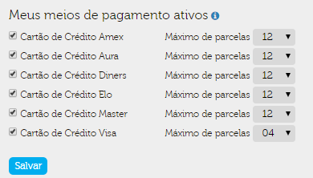
 
**OBS:** O Check Box deve estar marcado para que o meio de pagamento seja exibido na tela transacional.
 
**Características**
 
* Disponível nas integrações do Checkout Cielo via API ou Botão;
* O valor total dos itens do carrinho é somado e dividido pela quantidade de parcelas do lojista;
* O valor da compra é sempre o mesmo, independentemente da quantidade de parcelas escolhida pelo comprador (Não há cobrança de Juros);
* O valor do frete é somado ao valor do parcelamento;
* A opção “à vista” sempre está disponível ao comprador.
* Todas as transações possuirão as mesmas opções de parcelamento.

## Parcelamento via API

Nesta opção, o lojista pode configurar a quantidade de parcelas por venda, especificado via request da API no momento de envio da transação.
O Checkout realiza o cálculo das parcelas considerando valor total e limite parcelas enviadas via API.
 
**ATENÇÃO:** Nesta opção de parcelamento, o número de parcelas desejadas deve ser inferior a quantidade que está cadastrada no backoffice Checkout. 
 
**Características**
 
* O lojista envia a quantidade máxima de parcelas que deseja exibir ao comprador.
* O valor do frete é somado ao valor do parcelamento.
  
O Parcelamento via API é realizado enviando o campo `MaxNumberOfInstallments` dentro do nó Payment. Isso forçará o Checkout a recalcular o valor do parcelamento.
Abaixo, um exemplo do Nó

```json
"Payment": {
  "MaxNumberOfInstallments": 3
}
```

| Campo                         | Tipo         | Obrigatório | Tamanho | Descrição                                                                                               |
|-------------------------------|--------------|-------------|---------|---------------------------------------------------------------------------------------------------------|
| `MaxNumberOfInstallments`     | Numeric      | Condicional | 2       | Define valor máximo de parcelas apresentadas no transacional, ignorando configuração do Backoffice      |

# Recorrência do Checkout Cielo

A Recorrência é um processo de agendamento automático de transações de crédito, ou seja, é uma transação que se repetirá automaticamente, sem a necessidade do comprador acessar a tela transacional, de acordo com as regras definidas no momento do agendamento.
 
<aside class="notice">Caso uma das transações não seja autorizada, o Checkout Cielo executa a retentativa automaticamente; para mais detalhes sobre a retentativa automática, veja a seção <a href="#retentativa">Retentativa</a>.</aside>
 
Transações recorrentes são ideais para modelos de negócios que envolvam o **conceito de assinatura, plano ou mensalidade** na sua forma de **cobrança**. 
Alguns exemplos de negócios são: 
 
* Escolas
* Academias
* Editoras
* Serviços de hospedagem
 
**Diferença entre transações recorrentes e parceladas:**
 
|Tipo|Descrição|
|---|---|
|**Parceladas**|Se trata de **uma transação dividida em vários meses**. <BR>O valor total da venda compromete o limite do cartão de crédito do comprador independentemente do valor da parcela inicial.<BR> O lojista recebe o valor da venda parceladamente e não corre o risco de uma das parcelas ser negada.<br><br> **EX**: Venda de R$1.000,00 parcelado em 2 vezes. Apesar de o comprador pagar apenas R$500,00 na primeira parcela, o valor do limite de crédito consumido é o integral, ou seja, R$1.000,00. Se o limite do cartão for inferior ou o montante não estiver liberado, a R$1.000,00 a transação será negada|
|**Recorrentes**|São **transações diferentes realizadas no mesmo cartão em momentos previamente agendados**.<BR> A primeira venda agenda as futuras vendas a partir de um intervalo de tempo pré definido.<BR>  A cada intervalo haverá uma cobrança no cartão de crédito. <BR> O pagamento recorrente bloqueia do limite do cartão apenas o valor debitado na data da primeira venda recorrente e do valor total da venda.<br><br> **EX**: Venda de R$ 1.000,00 em 15/01/2015, com recorrência mensal e data final em 01/06/2015. Todo dia 15 haverá uma nova cobrança de R$1.000,00 no cartão do comprador, se repetindo até 15/05/2015, última data válida antes da data final.|

## Recorrência por API

Uma transação de recorrência no Checkout Cielo possui duas configurações: `Intervalo` e `Data de encerramento`.
 
* **Intervalo** – padrão de repetição e intervalo de tempo entre cada transação. Esse intervalo temporal entre as transações podem ser: Mensal, Bimestral, Trimestral, Semestral e Anual.
* **Data de encerramento** – Data que o processo de recorrência deixa de ocorrer.

```json
"Payment": {
        "RecurrentPayment": {
            "Interval": "Monthly",
            "EndDate": "2018-12-31"
        }
```

**Payment.RecurrentPayment**
 
| Campo                                | Tipo         | Obrigatório | Tamanho | Descrição                                                                                               | 
|--------------------------------------|--------------|-------------|---------|---------------------------------------------------------------------------------------------------------|
| `Payment.RecurrentPayment.Interval`  | Alphanumeric | Sim         | 10      | Intervalo entre cada transação da recorrencia                                                           |                  
| `Payment.RecurrentPayment.EndDate`   | YYYY-MM-DD   | Não         | 255     | Data onde a Recorrência se encerrará; Se não enviado a recorrência se encerra somente se cancelada      |                                                              
 
| Intervalo    | Descrição  |
|--------------|------------|
| `Monthly`    | Mensal     |
| `Bimonthly`  | Bimestral  |
| `Quarterly`  | Trimestral |
| `SemiAnnual` | Semestral  |
| `Annual`     | Anual      |
  
Os dados do cartão de crédito do comprador ficam armazenados de forma segura dentro do Checkout Cielo, permitindo sua reutilização em uma transação recorrente. Esses dados não são acessados pelo lojista e essa inteligência é controlada pelo Checkout Cielo.
 
Exceto o objeto `Payment` que contém um novo elemento específico para a recorrência chamado `RecurrentPayment`, todos os outros objetos são iguais à integração com o Carrinho.

> REQUISIÇÃO

```json
{
    "OrderNumber": "12344",
    "SoftDescriptor": "Nome que aparecerá na fatura",
    "Cart": {
        "Discount": {
            "Type": "Percent",
            "Value": 10
        },
        "Items": [
            {
                "Name": "Nome do produto",
                "Description": "Descrição do produto",
                "UnitPrice": 100,
                "Quantity": 2,
                "Type": "Asset",
                "Sku": "Sku do item no carrinho",
                "Weight": 200
            }
        ]
    },
    "Shipping": {
        "Type": "Correios",
        "SourceZipCode": "14400000",
        "TargetZipCode": "11000000",
        "Address": {
            "Street": "Endereço de entrega",
            "Number": "123",
            "Complement": "",
            "District": "Bairro da entrega",
            "City": "Cidade de entrega",
            "State": "SP"
        },
        "Services": [
            {
                "Name": "Serviço de frete",
                "Price": 123,
                "Deadline": 15
            }
        ]
    },
    "Payment": {
        "BoletoDiscount": 0,
        "DebitDiscount": 0,
        "RecurrentPayment": {
            "Interval": "Monthly",
            "EndDate": "2015-12-31"
        }
    },
    "Customer": {
        "Identity": 11111111111,
        "FullName": "Fulano Comprador da Silva",
        "Email": "fulano@email.com",
        "Phone": "11999999999"
    },
    "Options": {
        "AntifraudEnabled": false
    }
}
```

**Exemplo**: Bem Físico
 
Se o tipo de produto for `Bem Físico`, a **API obriga o envio do tipo de frete**. 
Se no contrato técnico existir o nó da recorrência, fica obrigatório o tipo `WithoutShipping`, caso contrário, a seguinte resposta será apresentada:

> RESPONSE

```json
{
    "message": "The request is invalid.",
    "modelState": {
        "[Shipping.Type]": [
            "[Shipping.Type] pedidos com recorrência devem possuir o Shipping.Type 'WithoutShipping'."
        ]
    }
}
```

**IMPORTANTE:** A Recorrência é criada apenas se a transação for **AUTORIZADA**. Independente de captura ou não, uma vez autorizada, o processo de recorrência se inicia.

## Recorrência por Botão

Uma maneira de realizar a recorrência dentro do Checkout é criar um botão recorrente.
 
Basta cadastrar o produto, incluindo um intervalo de cobrança e uma data para encerramento (Opcional), como no exemplo abaixo:
 

 
**ATENÇÃO:** Caso um botão seja utilizado após a “Data final” cadastrada, a transação apresentará um erro exibindo **Oppss** na tela transacional. A Data pode ser editada na tela de edição do botão dentro de “Detalhes do Produto”

## Retentativa de Recorrências

Caso uma das transações da recorrência não seja autorizada, o Checkout Cielo executa a retentativa automaticamente, o envio de uma nova transação, considerando:
 
* **Intervalo de tempo entre as tentativas:** 1 dia
* **Quantidade de retentativas:** 3 (três), uma por dia, por 3 dias corridos a partir do dia seguinte da transação original não autorizada.
 
**OBS**: Esse processo visa manter obter uma resposta positiva do processo de autorização, impedindo o lojista de perder a venda. O Processo de retentativa gera pedidos duplicados dentro do Backoffice, pois o pedido original, negado, será apresentado na lista de Pedidos, junto com a nova transação autorizada 
 
**ATENÇÃO:**A regra da retentativa não pode ser modificada pelo lojista.

## Consultando transações

As transações de Recorrência ficam disponíveis no Backoffice Checkout Cielo como as outras vendas de sua loja na aba “PEDIDOS” (veja imagem abaixo).
 
A primeira transação da recorrência é uma transação normal, seguindo as regras e preferências definidas pelo lojista no Backoffice.
 
**ATENÇÃO:** O valor e data de cobrança das transações recorrentes serão sempre os mesmos da transação inicial. O agendamento passa a funcionar automaticamente a partir da data em que a primeira transação for autorizada.
 

 
Esta tela mostra a data que a 1° transação da recorrência foi autorizada e deverá ser capturada manualmente. **As demais transações da recorrência sempre serão capturadas automaticamente**, independente se primeira transação foi capturada ou cancelada. Se o Cliente tiver configurado Captura automática, a captura da recorrência também será automática.
 
**ATENÇÃO:** Somente a 1° transação é submetida a análise do antifraude

## Cancelamento de Recorrência no Checkout Cielo.

O cancelamento da recorrência ocorre dentro do Backoffice do Checkout Cielo, também na aba “PEDIDOS”. Basta:
 
1. Acessar uma transação de recorrência (marcada com o símbolo “Recorrente”)
2. Entrar em Detalhes (o símbolo de “+”)
 

<br>
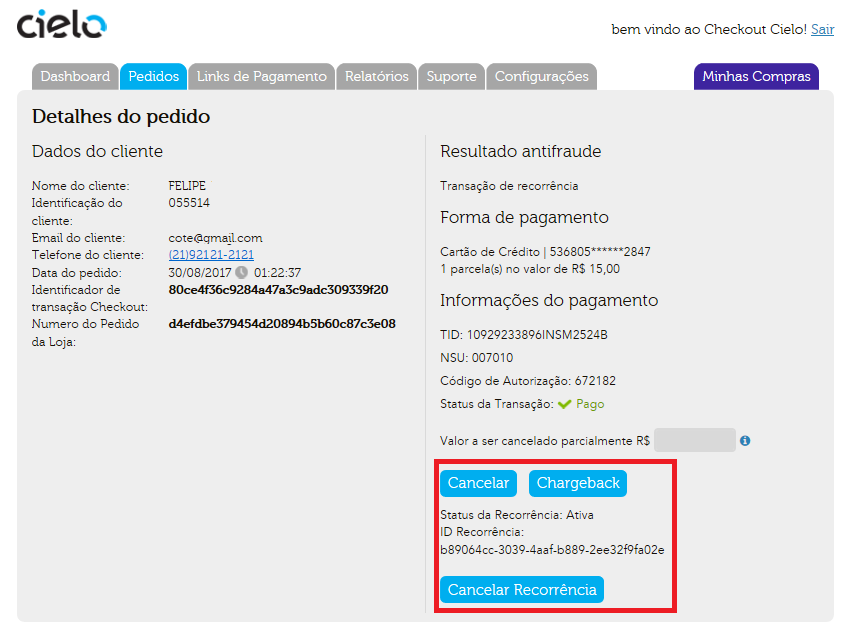
 
Tela de detalhes da Recorrência
 
Na tela acima, há duas opções de Cancelamento pelos botões:
 
* **Cancelar** – Cancela a transação, sem efetuar o cancelamento das futuras transações de recorrência.
* **Cancelar Recorrência** - Cancela o agendamento de futuras transações, encerrando a recorrência. Não cancela a transação atual nem as que já ocorreram. Essas necessitam ser canceladas manualmente.
 
**ATENÇÃO:**
* A Recorrência ocorre somente para Cartões de crédito e para produtos tipo “SERVIÇO” e “BENS DIGITAIS”.
* A Recorrência é iniciada no momento da AUTORIZAÇAO, NÃO NA CAPTURA. Se a recorrência não tiver uma data para ser finalizada, ela se repetirá automaticamente até ser cancelada manualmente.
* Sua afiliação Cielo deve ser habilitada para transacionar sem CVV ou Em recorrência, do contrário, todas as transações recorrentes serão negadas.

## Edição da Recorrência

O Checkout Cielo permite que o lojista modifique 3 dados da recorrencia:
 
* **Ativação** - Uma recorrência pode ser ativada ou desativada. EX: Suspensão de uma assinatura por um periodo de 3 meses; Basta definir a Recorrência como inativa.
* **Intervalo** - É possivel modificar o intervalo de execução.
* **Dia de ocorrência** - É possivel modificar o dia de execução da transação recorrente.
 
A atualização é feita exclusivamente via o Backoffice Cielo. Acesso o [**Tutorial do Backoffice Checkout Cielo**](https://developercielo.github.io/Checkout-Backoffice/) para mais informações.

# Suporte Cielo

Após a leitura deste manual, caso ainda persistam dúvidas (técnicas ou não), a Cielo disponibiliza o suporte técnico 24 horas por dia, 7 dias por semana em idiomas (Português e Inglês), nos seguintes contatos:
 
* +55 4002-9700 – *Capitais e Regiões Metropolitanas*
* +55 0800-570-1700 – *Demais Localidades*
* +55 11 2860-1348 – *Internacionais*
  * Opção 1 – *Suporte técnico;*
  * Opção 2 – *Credenciamento E-commerce.*
* Email: [cieloecommerce@cielo.com.br](mailto:cieloecommerce@cielo.com.br)
